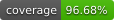
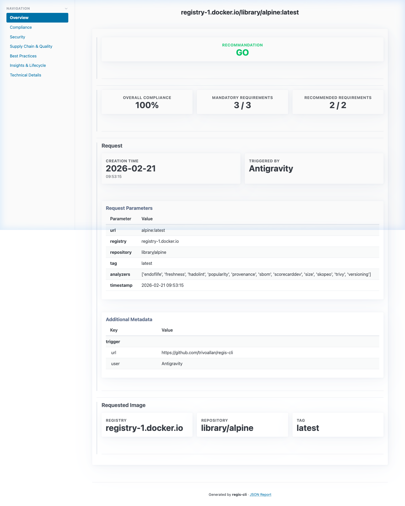

# Regis

> **Registry Scores** — Container Security & Policy-as-Code Orchestration

Regis provides unified container analysis, custom playbooks, and highly customizable interactive reports for production-ready CI/CD.

**[Explore the interactive example report →](https://trivoallan.github.io/regis/regis/0.14.0/_attachments/examples/alpine/index.html)**

## Key Features

- **Unified Registry Inspection** — Fast, multi-arch metadata extraction from any OCI-compliant registry using `regctl`.
- **Pluggable Analyzer Ecosystem** — Orchestrates industry-standard tools like `Trivy`, `regctl`, `Hadolint`, and `Dockle` to gather comprehensive security insights.
- **Policy-as-Code Playbooks** — Define compliance and security rules (e.g., "no critical vulnerabilities", "maximum image age") using flexible `jsonLogic` evaluations.
- **Hybrid Reporting** — Simultaneously generates machine-readable JSON for automation and rich, interactive HTML dashboards for human review.
- **CI/CD Native** — Designed to integrate seamlessly into GitHub Actions or GitLab CI pipelines with first-class support for MR/PR reporting.
- **Efficient Caching** — Reuse existing analysis results to speed up repeated evaluations and report regeneration.

## Documentation

Full documentation lives at **[trivoallan.github.io/regis](https://trivoallan.github.io/regis/)**:

- 🚀 [Getting Started](https://trivoallan.github.io/regis/docs/usage/getting-started) — install Regis and run your first analysis.
- 📚 [Concepts](https://trivoallan.github.io/regis/docs/concepts/introduction) — analyzers, playbooks, rules, and scoring.
- 🛠️ [Usage Guides](https://trivoallan.github.io/regis/docs/usage/analyze-image) — analyze images, manage scanner tools, configure registries.
- 📖 [CLI Reference](https://trivoallan.github.io/regis/docs/reference/cli) — every command and flag.

## GitHub Action

Run Regis in CI with the [**regis-security-analysis**](https://github.com/marketplace/actions/regis-security-analysis) GitHub Action. It is maintained in its own repository — [**trivoallan/regis-action**](https://github.com/trivoallan/regis-action) (`uses: trivoallan/regis-action@v1`) — where you will find its inputs, outputs, and usage examples.

## License

MIT
