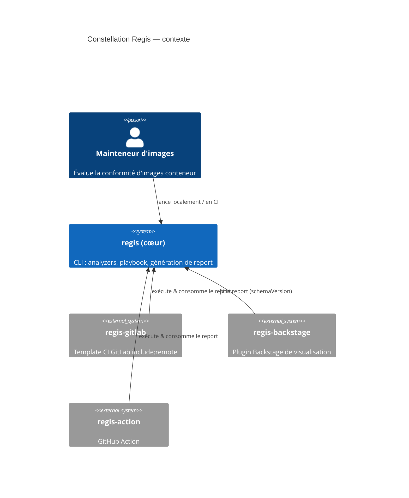

# Glossaire & modèle mental — constellation Regis

> Vocabulaire partagé. En cas de divergence avec le code, le code fait foi —
> signalez l'écart pour mettre ce fichier à jour.

## Le produit est éclaté

« Regis » n'est pas un dépôt : c'est un cœur (`regis`) plus des intégrations qui
consomment son contrat de rapport.

## Le modèle de vocabulaire à quatre couches

Le mot « rule » était surchargé. Il est désormais désambiguïsé en quatre couches
(décision 2026-06-05) :

| Couche        | Sens                                                                                  |
| ------------- | ------------------------------------------------------------------------------------- |
| **finding**   | une détection locale d'un problème par un analyzer (terme local).                     |
| **metric**    | un agrégat exposé par un analyzer (`results.*`), ce que les critères lisent.          |
| **criterion** | une condition réutilisable et paramétrée livrée par un analyzer (ex `cve-count`). Anciennement « default rule »/template. Espace JSON Logic : `criterion.params`. |
| **rule**      | la décision de politique liée au playbook : criterion + options + severity + tier.    |

Termes voisins :

- **component** (SBOM) — un élément d'inventaire ; explicitement **pas** un finding.
- **check** — réservé à la commande `regis check` ; **ne pas** l'employer pour « criterion » (collision).

## Autres termes

- **analyzer** — plugin (`BaseAnalyzer`) qui produit findings + metrics + critères par défaut. Enregistré via `project.entry-points."regis.analyzers"`.
- **playbook** — document YAML (enveloppe Kubernetes-style `apiVersion`/`kind`/`metadata`/`spec`) qui lie des critères en règles et décrit la présentation.
- **presentation** — section neutre `spec.presentation` d'un playbook (ex-`spec.integrations.gitlab`), pilotant le rendu/identité du report.
- **report** — sortie sérialisée versionnée par `schemaVersion` ; le contrat que les intégrations consomment (voir `contract.md`).
