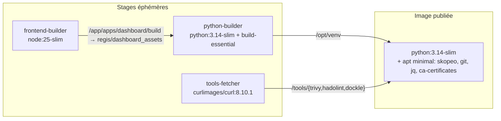

# Design — Réduction de la taille de l'image Docker publiée

**Date** : 2026-05-22
**Statut** : Design validé, plan d'implémentation à rédiger
**Type** : Breaking change pré-1.0 (bump mineur garanti)

## Contexte

L'image Docker `ghcr.io/trivoallan/regis` actuelle (v0.31.0) est construite via un Dockerfile à 2 stages. Le stage final inclut :

- Le runtime Node.js + pnpm (copiés depuis le stage frontend-builder), uniquement utilisés par `regis bootstrap archive --dev` et `--repo`.
- Les outils de fetch (`curl`, `gnupg`) qui ne servent qu'au build.
- Le source complet du projet (`COPY . .` avec un `.dockerignore` minimal).
- L'installation pip directement dans Python système (pas de venv isolé).

Cette structure pèse sur trois axes simultanément :

1. **Temps de pull en CI** — les pipelines GitLab/GitHub (jobs `analyze_image`) sont ralentis par le pull.
2. **Surface d'attaque** — Node, pnpm, curl, gnupg, gcc augmentent la surface scannée par trivy/dockle et le risque de CVEs runtime.
3. **Coût stockage / bande passante** — registre GHCR, bande passante des utilisateurs finaux.

## Objectifs

- Réduire la taille décompressée de l'image d'au moins **50 %**.
  - **Résultat mesuré (2026-05-22)** : taille tar (compressed registry artifact) 244 MB → 186 MB pour la nouvelle image, soit ~24 % de réduction. En deçà du target. La couche apt qui amène `skopeo` (208 MB décompressé / ~80 MB compressé) domine ce qui reste — voir Hors scope pour pistes v2.
- Éliminer tout outil de build de l'image finale (`gcc`, `curl`, `npm`, `pnpm`, `node`, `gnupg`).
- Empêcher les régressions futures via une gate CI de taille hardcodée.
- Préserver la compatibilité multi-arch (amd64 + arm64).
- Garantir un bump de version **mineur** (0.31.0 → 0.32.0), pas majeur.

### Non-objectifs

- Migrer vers une base autre que `python:3.14-slim` (alpine/distroless/wolfi écartés pour limiter le risque de régression).
- Supporter le bootstrap dans l'image (breaking change accepté — les commandes `--dev`/`--repo` deviennent host-only).
- Maintenir une variante `:full` avec Node en parallèle (breaking change net, pas de transition).

## Architecture

Build multi-stage Docker à 4 stages éphémères + 1 stage final publié.



### Principes structurels

- Une responsabilité par stage → cache Docker maximal, debugging et observabilité plus simples.
- L'image finale ne contient **aucun outil de build** : pas de `curl`, `gnupg`, `gcc`, `npm`, `pnpm`, `node`.
- Le venv Python est construit dans un stage isolé puis copié atomiquement → pas de pip cache résiduel.
- Le téléchargement des binaires se fait dans un stage dédié → cache invalidé seulement quand on bump une version d'outil.

## Composants

### 1. Dockerfile (réécriture)

| Stage              | Base                     | Rôle                                                                                                                                                           | Sortie copiée dans final                                                               |
| ------------------ | ------------------------ | -------------------------------------------------------------------------------------------------------------------------------------------------------------- | -------------------------------------------------------------------------------------- |
| `frontend-builder` | `node:25-slim`           | `pnpm install --frozen-lockfile` + `pnpm run build` du dashboard                                                                                               | Consommé par `python-builder` (pas directement par `final`)                            |
| `python-builder`   | `python:3.14-slim`       | `apt install build-essential` ; copie source + dashboard build dans `regis/dashboard_assets` ; `python -m venv /opt/venv` ; `pip install --no-cache-dir .`     | `/opt/venv` → `/opt/venv` (dashboard_assets inclus dans le package via `package-data`) |
| `tools-fetcher`    | `curlimages/curl:8.10.1` | `ARG TARGETARCH` ; téléchargement trivy (script officiel), hadolint, dockle ; `chmod +x`                                                                       | `/tools/*` → `/usr/local/bin/`                                                         |
| `final`            | `python:3.14-slim`       | `apt install --no-install-recommends skopeo git jq ca-certificates` ; `useradd regis` ; `ENV PATH=/opt/venv/bin:$PATH` ; `USER regis` ; `ENTRYPOINT ["regis"]` | —                                                                                      |

**Choix multi-arch** : remplacer les `uname -m` par les ARG BuildKit `TARGETARCH`/`TARGETOS` (cleaner, conventionnel dans `docker buildx`).

**Working directory et user** :

- Plus de `WORKDIR /app` traînant avec le source complet.
- Working directory au lancement = `$HOME` (= `/home/regis`).
- Dashboard intégré au package via `package-data` (résolu via `importlib.resources` au runtime, comme actuellement).

### 2. `.dockerignore` (étendu)

Ajouts :

```gitignore
docs/
tests/
CHANGELOG.md
*.md         # sauf README.md
coverage-badge.svg
.serena/
.agent/
apps/dashboard/build/
apps/dashboard/.docusaurus/
package-lock.json   # on garde pnpm-lock.yaml
**/__pycache__
**/*.test.ts
.trunk/
```

Note : `COPY` ciblé dans chaque stage réduit déjà fortement la surface, mais un `.dockerignore` strict reste filet de sécurité.

### 3. `regis/commands/bootstrap.py` (vérification Node/pnpm en amont)

Au début de `bootstrap_archive` quand `--dev` ou `--repo` est actif, ajouter :

```python
if dev or repo:
    if not shutil.which("node"):
        raise click.ClickException(_node_missing_message())
    if not shutil.which("pnpm"):
        raise click.ClickException(_pnpm_missing_message())
```

Le message d'erreur est structuré (raison + commandes d'install nvm/fnm/brew + indication d'exécuter depuis le host).

### 4. CI : gate de taille via `wemake-services/docker-image-size-limit`

Nouveau job dans `cd-docker.yml` (ou workflow dédié `image-size.yml`) :

- Triggers : `pull_request` (paths : `Dockerfile`, `.dockerignore`, `pyproject.toml`, `Pipfile*`, `apps/dashboard/**`).
- Étapes :
  1. `docker/setup-buildx-action`
  2. `docker build` local (sans push) → tag `regis:size-check`
  3. `wemake-services/docker-image-size-limit@vX` avec :
     - `image: regis:size-check`
     - `size: <LIMIT>` ← valeur fixée après première mesure, dans un PR de suivi

Pas de baseline JSON, pas de commentaire PR : l'action échoue le job avec un message explicite si la limite est dépassée.

### 5. Documentation à mettre à jour

- `README.md` : note breaking change (Node retiré, bootstrap → host) + badge taille hardcodé.
- `docs/website/docs/integrations/*` : prerequisite Node sur le host pour `bootstrap archive --dev/--repo`.
- `docs/memory-bank/activeContext.md` + `progress.md` : entrée datée 2026-05-22.
- **`CHANGELOG.md` non touché** — géré automatiquement par Release Please depuis les conventional commits.

### 6. `release-please-config.json` — `bump-minor-pre-major`

Ajout :

```json
{
  "packages": {
    ".": {
      "bump-minor-pre-major": true,
      ...
    }
  }
}
```

Garantit que tout `feat!:` en pré-1.0 reste sur un bump mineur (0.31.0 → 0.32.0). Commit dédié `chore(release): keep minor bumps for breaking changes pre-1.0`, idéalement mergé **avant** le PR principal pour une séquence Release Please propre.

## Flux de build

```text
frontend-builder
  1. WORKDIR /app
  2. COPY package.json pnpm-lock.yaml pnpm-workspace.yaml ./
  3. COPY apps/ apps/
  4. RUN pnpm install --frozen-lockfile
  5. RUN cd apps/dashboard && pnpm run build
  Output: /app/apps/dashboard/build

python-builder
  1. apt install --no-install-recommends build-essential
  2. python -m venv /opt/venv
  3. ENV PATH=/opt/venv/bin:$PATH
  4. COPY pyproject.toml Pipfile Pipfile.lock ./
  5. COPY regis/ regis/
  6. COPY --from=frontend-builder /app/apps/dashboard/build regis/dashboard_assets
  7. RUN VERSION=... && SETUPTOOLS_SCM_PRETEND_VERSION="$VERSION" pip install --no-cache-dir .
  Output: /opt/venv (avec dashboard_assets packagé proprement)

tools-fetcher
  ARG TARGETARCH
  1. curl trivy install script -o /tools/trivy
  2. curl hadolint-Linux-{x86_64|arm64}
  3. curl & tar dockle ({64bit|ARM64})
  4. chmod +x /tools/*
  Output: /tools/{trivy,hadolint,dockle}

final
  1. LABEL org.opencontainers.image.*
  2. ENV PYTHONDONTWRITEBYTECODE=1 PYTHONUNBUFFERED=1
  3. RUN apt update && apt upgrade -y && apt install --no-install-recommends \
       skopeo git jq ca-certificates && rm -rf /var/lib/apt/lists/*
  4. RUN groupadd -g 1001 regis && useradd -u 1001 -g regis -m -d /home/regis regis
  5. COPY --from=python-builder /opt/venv /opt/venv
  6. COPY --from=tools-fetcher /tools/* /usr/local/bin/
  7. ENV PATH=/opt/venv/bin:$PATH HOME=/home/regis
  8. USER regis
  9. HEALTHCHECK ... CMD regis list || exit 1
  10. ENTRYPOINT ["regis"] / CMD ["--help"]
```

## Gestion d'erreurs

### Runtime

| Scénario                                                 | Comportement attendu                                                                    |
| -------------------------------------------------------- | --------------------------------------------------------------------------------------- |
| `regis bootstrap archive` sans `--dev`/`--repo`          | OK — génère les fichiers du template (pas besoin de Node)                               |
| `regis bootstrap archive --dev`/`--repo` sans Node       | `click.ClickException` exit 1, message structuré (install nvm/fnm/brew + run from host) |
| `regis bootstrap archive --dev` avec Node mais sans pnpm | Même style de message, suggère `corepack enable` ou `npm install -g pnpm@10`            |
| Healthcheck `regis list` crashe                          | Exit 1 → Docker marque unhealthy (inchangé)                                             |
| `trivy`/`skopeo`/`hadolint`/`dockle` absent du PATH      | `require_tool()` dans `utils/process.py` lève `RuntimeError` (inchangé)                 |

### Build / CI

| Scénario                                    | Comportement attendu                                             |
| ------------------------------------------- | ---------------------------------------------------------------- |
| Téléchargement trivy/hadolint/dockle KO     | `curl -sfL` → exit non-zero → build fail tôt                     |
| `pip install` échoue dans python-builder    | Build fail, aucune image partielle                               |
| `pnpm run build` échoue                     | Build fail dans frontend-builder, aucun dashboard partiel        |
| Architecture inattendue (ni amd64 ni arm64) | `tools-fetcher` échoue avec message explicite                    |
| Image dépasse la limite CI                  | Job `wemake-services/docker-image-size-limit` échoue, PR bloquée |

## Testing & vérification

### Tests automatisés

| Test                      | Où                                                           | Quoi vérifier                                                                                                                            |
| ------------------------- | ------------------------------------------------------------ | ---------------------------------------------------------------------------------------------------------------------------------------- |
| Build local Dockerfile    | CI `cd-docker.yml`                                           | Build succès pour amd64 et arm64                                                                                                         |
| Limite de taille          | Nouveau job CI via `wemake-services/docker-image-size-limit` | Taille image ≤ `<LIMIT>`                                                                                                                 |
| Smoke test runtime        | Step après build                                             | `docker run regis:test regis --help` ; `regis list` ; `trivy --version` ; `skopeo --version` ; `hadolint --version` ; `dockle --version` |
| Test bootstrap sans Node  | pytest                                                       | Mock `shutil.which("node")` → None ; `regis bootstrap archive --dev` lève ClickException avec message attendu                            |
| Test bootstrap sans pnpm  | pytest                                                       | Mock `shutil.which("pnpm")` → None ; même comportement                                                                                   |
| Tests unitaires existants | `pipenv run pytest`                                          | Tous passent, couverture ≥ 90%                                                                                                           |

### Vérifications manuelles avant merge

1. `docker build -t regis:size-check .` → noter taille via `docker image inspect`.
2. `docker run --rm regis:size-check regis list` → liste analyzers affichée.
3. `docker run --rm regis:size-check regis analyze docker.io/library/alpine:3.19` → analyse complète + dashboard rendu.
4. `docker run --rm regis:size-check regis bootstrap archive --dev /tmp/test` → exit 1 + message Node missing.
5. `docker history regis:size-check` → aucune couche avec gcc, npm, pnpm, node, curl (sauf indirect via skopeo).
6. (optionnel) `dive regis:size-check` → confirmation visuelle.

### Critères de succès

#### Quantitatifs

- Taille image décompressée : ≤ 50 % de la taille actuelle.
- Aucune régression fonctionnelle (tous analyzers tournent, report s'affiche, `bootstrap playbook` fonctionne).
- CI `image-size` job vert sur la PR finale.

#### Qualitatifs

- Couches Docker plus petites et plus nombreuses → meilleure réutilisation par les utilisateurs.
- Aucun outil de build dans l'image finale (vérifiable par `docker run --rm regis:size-check which gcc` → exit ≠ 0).

## Séquence de PRs

1. **PR 1** _(préparatoire)_ — `chore(release): keep minor bumps for breaking changes pre-1.0`
   - Modifie uniquement `release-please-config.json` (ajout `bump-minor-pre-major: true`).
   - Merge prioritaire pour que la séquence Release Please soit propre.

2. **PR 2** _(principal)_ — `feat(build)!: drop Node from runtime image and adopt 4-stage build`
   - Réécriture `Dockerfile`.
   - Extension `.dockerignore`.
   - Modifications `regis/commands/bootstrap.py` + tests pytest associés.
   - Mise à jour `README.md` + `docs/website/docs/integrations/*`.
   - Mise à jour memory bank.
   - Label GitHub `whats-new`.
   - **Ne contient pas** le job CI de gate de taille (qui a besoin de la nouvelle taille mesurée).

3. **PR 3** _(suivi)_ — `ci(build): enforce docker image size limit`
   - Ajout du job avec `wemake-services/docker-image-size-limit`.
   - Valeur `size:` fixée à partir de la taille mesurée sur PR 2.
   - Badge taille hardcodé dans `README.md`.

## Risques et atténuations

| Risque                                                                  | Probabilité       | Atténuation                                                                              |
| ----------------------------------------------------------------------- | ----------------- | ---------------------------------------------------------------------------------------- |
| Casse de `bootstrap archive --dev`/`--repo` pour utilisateurs existants | Élevée (attendue) | Breaking change explicite + label `whats-new` + message d'erreur structuré               |
| `--frozen-lockfile` échoue si `pnpm-lock.yaml` désynchronisé            | Moyenne           | Couvert par tests CI existants ; aucun changement de comportement                        |
| Réorganisation du dashboard path casse `importlib.resources`            | Moyenne           | Smoke test `regis analyze` en CI vérifie le rendu du dashboard                           |
| Multi-arch `tools-fetcher` échoue sur arm64                             | Faible            | Pinning explicite des versions + smoke test sur les deux arches                          |
| `wemake-services/docker-image-size-limit` non maintenu                  | Faible            | Action stable ; fallback possible vers un `bash` simple comparant `docker image inspect` |
| Bump de version inattendu (major au lieu de minor)                      | Faible            | PR 1 séparé qui fix la config Release Please **avant** le PR principal                   |

## Hors scope (potentiel suivi v2)

- Migration vers une base alternative (alpine, distroless, wolfi).
- Image squashing via `docker-slim`.
- Variante `:full` pour utilisateurs nécessitant Node embarqué.
- Génération de SBOMs spécifiques à l'image (déjà couverts par `cd-docker.yml`).
