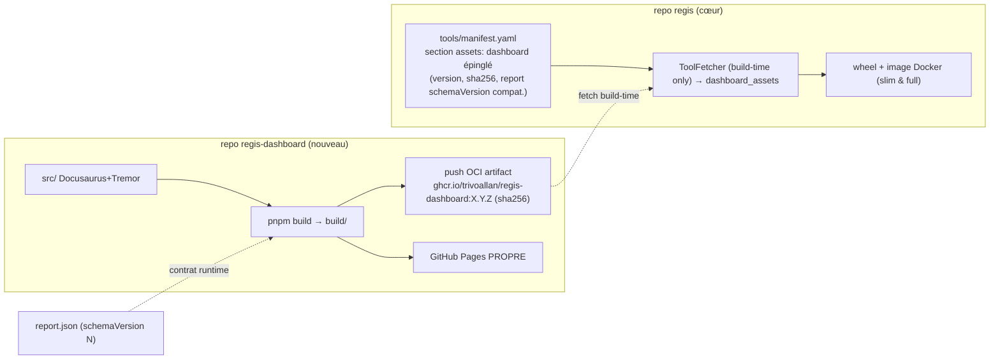

# Dashboard Repo Split — Design & Plan

(Plan slug: `dashboard-repo-split`)

## Status: Planning

> Issu du brainstorm [2026-05-31]. Tranche le point « Monorepo vs split (pré-v1) »
> resté ouvert dans `activeContext.md` → voir `decisionLog.md` [2026-05-31].

## Contexte

`apps/dashboard` (Docusaurus + Tremor/React) vit aujourd'hui dans le mono-repo `regis`.
Couplage actuel :

| Lien | Nature | Localisation |
| --- | --- | --- |
| Build → assets embarqués | **dur** (build/packaging) | `Dockerfile` stage `frontend-builder` → `regis/dashboard_assets` ; `pyproject.toml` package-data `dashboard_assets/**/*` |
| Build live / bundled | **dur** | `regis/report/docusaurus.py` (mode *source* vs *bundled*) |
| Workspace JS | **dur** | `pnpm-workspace.yaml` (`apps/*` + `docs/website`) |
| Contrat données | **souple** (déjà propre) | `report.json` ↔ `regis/schemas/report/report.schema.json`, consommé runtime par `ReportProvider.tsx` / `Root.tsx` |
| Serveur | souple | `regis/server/` (extra `[server]`) |
| Template archive | dur (duplication) | `regis/cookiecutters/archive` + `apps/dashboard/.regis-sync.json` |
| Déploiement | CI | `cd-dashboard.yml` → gh-pages cœur `/regis/tools/<ver>/dashboard/` |

## Moteurs (validés)

1. **Cadences de release découplées** — releaser le dashboard indépendamment du CLI.
2. **Alléger le dépôt cœur** — sortir Node/pnpm/Docusaurus du **chemin de build du package Python**.

Écartés explicitement : réutilisation produit autonome, gouvernance front/back distincte.

## Décision d'architecture

Le dashboard devient un **artefact versionné publié** ; le cœur **consomme une version épinglée**
à son build-time. Le contrat reste `report.json`.

- ❌ **git submodule / subtree** — recouplent les cadences (bump dashboard = commit cœur), ne sortent pas Node du cœur.
- ✅ **Artefact OCI via `ToolFetcher`** — réutilise le pattern `tools/manifest.yaml` + `ToolFetcher` déjà livré (round 3).

### Schéma cible

## Décisions verrouillées (brainstorm 2026-05-31)

1. **Livraison = artefact OCI via `ToolFetcher`.** `regctl` est déjà une dépendance du cœur → pull sans nouvel outil. Le stage `frontend-builder` du Dockerfile disparaît ; **plus aucune toolchain Node sur le chemin de build du package Python**.
2. **Pas de lazy slim.** Les assets sont **toujours fetchés au build-time et bundlés** dans le wheel ET l'image (slim comme full). Donc `ToolFetcher` n'intervient qu'au build-time : **pas** de fetch runtime, **pas** d'intégration `doctor`/`bootstrap`/`REGIS_OFFLINE`/mirror à câbler côté dashboard.
3. **Déploiement = GitHub Pages propre** au nouveau dépôt. L'URL du site change (à recenser dans la finition « site de doc », Sprint 1).
4. **Template `archive`** consomme le **même artefact OCI épinglé** (source unique de vérité) — fini la copie voisine pilotée par `.regis-sync.json`.
5. **Ergonomie dev** : `REGIS_DASHBOARD_DIR` — si défini, `docusaurus.py` repasse en **mode source** sur un checkout local ; sinon mode bundled.
6. **`schemaVersion` (prérequis bloquant)** : ajouter `schemaVersion: 1` (entier) à `report.schema.json` **dans le cœur, avant le split** (pattern playbooks `schemaVersion: 1`). L'entrée manifest du dashboard déclare la **plage de `report.schemaVersion` supportée** ; le cœur refuse d'épingler un build incompatible.

## Séquencement (avant v1.0.0-alpha)

### Phase 0 — Prérequis dans le cœur (pré-split, non bloquant pour les users)

- [ ] Ajouter `schemaVersion: 1` à `regis/schemas/report/report.schema.json` (+ producteurs `regis/report/*`, + tests). Distinct du champ `version` (date de snapshot).
- [ ] Généraliser `tools/manifest.yaml` : nouvelle section `assets:` (bundle = tar de fichiers statiques, sha256 unique arch-indépendant) à côté de `tools:` ; étendre le loader typé + `ToolFetcher` pour extraire un bundle vers un répertoire.

### Phase 1 — Nouveau dépôt `regis-dashboard`

- [ ] `git filter-repo` / `subtree split` de `apps/dashboard` → nouveau dépôt, **historique préservé**.
- [ ] CI nouveau dépôt : build pnpm → push OCI (`regctl`/`oras`, tag SemVer, sha256) + deploy GitHub Pages propre.
- [ ] release-please + Conventional Commits dans le nouveau dépôt.
- [ ] Le build déclare la plage `report.schemaVersion` supportée (label OCI ou fichier manifest dans l'artefact).

### Phase 2 — Bascule du cœur

- [ ] Entrée `assets.dashboard` épinglée dans `tools/manifest.yaml` (version, sha256, plage schemaVersion).
- [ ] `Dockerfile` : supprimer le stage `frontend-builder` ; nouveau stage qui `regctl artifact get` l'artefact épinglé → `dashboard_assets`.
- [ ] Wheel : la CICD (publication PyPI) fetch l'artefact épinglé → `dashboard_assets` avant `python -m build`.
- [ ] `regis/report/docusaurus.py` : mode bundled par défaut ; mode source uniquement si `REGIS_DASHBOARD_DIR` défini.
- [ ] Cookiecutter `archive` : consommer l'artefact OCI épinglé.
- [ ] Retirer `apps/dashboard` du `pnpm-workspace.yaml` (reste `docs/website`).
- [ ] Supprimer `cd-dashboard.yml` du cœur ; ajouter `ci-dashboard-manifest.yml` (drift sha256 de l'entrée assets, calqué sur `ci-tools-manifest.yml`).

### Phase 3 — Doc & nettoyage

- [ ] Doc : process de bump dashboard (publier → bump manifest cœur), guide dev `REGIS_DASHBOARD_DIR`.
- [ ] Mettre à jour `activeContext.md` + `progress.md` ; clore le point « Monorepo vs split ».

## Risques / points d'attention

- **`docs/website` reste** dans le workspace pnpm du cœur (Docusaurus aussi) → Node n'est **pas éradiqué du dépôt**, seulement du **chemin de build du wheel/image**. Objectif packaging atteint ; à assumer explicitement.
- **Compatibilité** : sans `schemaVersion`, cadences découplées = casse silencieuse. Phase 0 bloquante.
- **Continuité d'URL** : Pages propre = nouvelle URL → liens à mettre à jour dans le site de doc.
- **Bump à deux temps** : tout changement de rendu = publier le dashboard puis bumper le manifest cœur. Documenter, et offrir `REGIS_DASHBOARD_DIR` pour le dev local.

## Hors périmètre

- Déplacer `docs/website` (autre concern).
- Open-sourcer/produit autonome le dashboard (moteur écarté).
- Lazy runtime fetch slim (écarté pour l'instant ; réversible — l'entrée manifest le permettrait plus tard).
