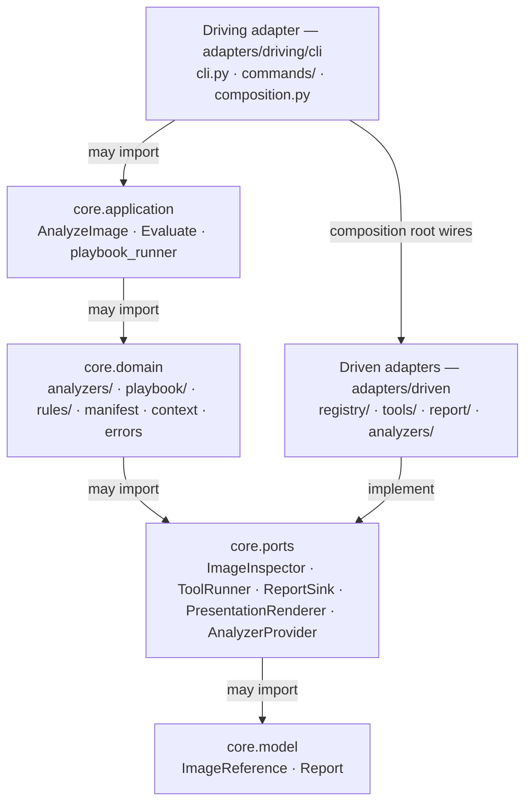

# System Patterns

## Architecture — hexagonal (ports & adapters)

`regis` follows a strict **ports & adapters** layout. The dependency rule is
enforced in CI by **import-linter** (`[tool.importlinter]` in `pyproject.toml`,
contract _"Hexagonal layering"_, job `hexagonal-layers`): a layer may import only
the layers below it. The migration that landed this (P0→P5, 2026-06) is recorded
in `decisionLog.md`.



### Layers (top → bottom; each imports only those below)

| Layer               | Package                       | Holds                                                                                                                                                                                                             |
| ------------------- | ----------------------------- | ----------------------------------------------------------------------------------------------------------------------------------------------------------------------------------------------------------------- |
| **Driving adapter** | `regis/adapters/driving/cli/` | `cli.py`, `commands/`, the composition root (`composition.py`) that wires use-cases to driven adapters                                                                                                            |
| **Application**     | `regis/core/application/`     | use-cases `AnalyzeImage` / `Evaluate` (own the loop, playbooks, emission), `playbook_runner`                                                                                                                      |
| **Domain**          | `regis/core/domain/`          | `analyzers/` (base + discovery + 14 analyzers), `playbook/` engine, `rules/` (JSON Logic), `manifest`, `context` (`AnalysisContext`), `errors`                                                                    |
| **Ports**           | `regis/core/ports/`           | `ImageInspector`, `ToolRunner`, `ReportSink`, `PresentationRenderer` (driven-side interfaces) + `AnalyzerProvider` (analyzer discovery)                                                                           |
| **Model**           | `regis/core/model/`           | value objects `ImageReference`, `Report`, `REPORT_SCHEMA_VERSION`                                                                                                                                                 |
| **Driven adapters** | `regis/adapters/driven/`      | `registry/` (HTTP + regctl inspectors, auth, URL parser), `tools/` (subprocess runner + tool-fetch infra), `report/` (`FileReportSink`, cookiecutter renderer, html), `analyzers/` (`EntryPointAnalyzerProvider`) |

The core is **Click-free** — Click lives only in the driving CLI adapter; driven
adapters own all I/O (subprocesses, registry HTTP, file writes, credentials).
Unlayered support packages (`utils/`, `schemas/`, `templates/`, `playbooks/`,
`cookiecutters/`, `data/`) sit outside the contract.

## Report Output Format Extension Pattern

New report output formats in `regis/utils/report.py` follow the `elif fmt == '<ext>':` pattern in `render_and_save_reports()`, delegating to a dedicated `_render_<fmt>()` helper.

Adding a format requires:

1. New `_render_<fmt>()` helper function in `report.py`
2. `elif fmt == '<ext>':` branch in `render_and_save_reports()`
3. CLI flag in `analyze.py` wired into both the main analysis path and the `--rerun` path

**Gotcha**: The `-m` shorthand is already taken by `--meta` in `regis analyze`. When adding new short flags to `analyze.py`, check existing shorthands first. `--markdown` has no short flag for this reason.

## Vocabulary: the four-layer policy model

Policy concepts are layered so "rule" is no longer overloaded (rename landed 2026-06-05, PR #646):

```text
finding → metric → criterion → rule
```

- **finding** — a raw detection from an analyzer (a CVE on a package, a leaked secret). Evidence; security analyzers only. SBOM **components** are inventory, _not_ findings.
- **metric** — an aggregate measurement an analyzer exposes (`critical_count`, `has_sbom`, `score`). What criteria evaluate; namespace `results.<analyzer>.<metric>` in conditions.
- **criterion** — a reusable, parameterized condition shipped by an analyzer via `default_criteria()` (e.g. `cve-count`). Policy-neutral: a JSON Logic `condition` + open `params`. Referenced in a playbook entry via the `criterion:` key; namespace `criterion.params.*`.
- **rule** — the policy decision: a criterion bound to concrete options + a severity level + a tier, in a playbook. "rule" now means only this layer (and `spec.rules`, the list of rules).

Backward compatibility: the legacy `rule:` entry key and `rule.*` condition namespace still resolve (the engine dual-binds both to the same object) but emit a `DeprecationWarning`; `BaseAnalyzer.default_rules()` is a deprecated shim. `regis playbook migrate` rewrites playbooks (idempotent, evaluation-preserving). The legacy path is removed at the next major.

## Rules and Standards

- **Python**: Use `uv` for dependency management.
- **CI/CD**: GitHub Actions with Release Please and Trunk (see CI/CD Gotchas below for full details).
- **Documentation**: Docusaurus for documentation as code.
- **Aesthetics**: High priority on visual excellence for HTML reports.

### Couverture de tests — double gate (global + par fichier)

La suite `uv run pytest` applique deux niveaux de garde :

1. **Global** : `--cov-fail-under=90` (paramètre pytest standard, lu depuis `pyproject.toml`).
2. **Par fichier** : `tests/_per_file_coverage.py` — plugin pytest maison enregistré via un
   hookwrapper `pytest_sessionfinish` dans `tests/conftest.py`. Il parcourt le rapport de
   couverture et fait échouer la session si un fichier sous `regis/` est en-dessous du seuil.

Les deux gates lisent le même seuil : `[tool.coverage.report].fail_under` dans `pyproject.toml`.
`tests/` est exclu de la mesure (pas de récursion). Les fichiers sans aucune instruction sont
ignorés. `--no-cov` désactive les deux gates.

## Dev Environment Gotchas

- **Stale editable-install entry points**: the analyzer registry (`discover_analyzers()`) is resolved from `importlib.metadata` entry points, which are **frozen into `entry_points.txt` at `pip install -e` time** and do **not** update when `pyproject.toml`'s `[project.entry-points."regis.analyzers"]` changes. After any pull/branch switch that adds, removes, or renames an analyzer entry point, **re-run `uv sync`** (or `uv run pip install -e . --no-deps`) to regenerate the metadata. Symptom: `ModuleNotFoundError` warnings for removed/renamed analyzers (`skopeo`, `trivy`) **and**, more insidiously, **silent absence** of newly added analyzers (`oci`, `cve`) — `analyze` runs without them and emits no error. Verify with `uv run python -c "from importlib.metadata import entry_points; [print(ep.name) for ep in entry_points(group='regis.analyzers')]"` and compare against `pyproject.toml`.

## CI/CD Gotchas

- **`ci-test.yml`** includes `pip-audit` and enforces a HIGH/CRITICAL severity gate via `scripts/enforce_pip_audit_severity.py` (severity is resolved from OSV metadata).
- **`cd-docker.yml`** emits CycloneDX/SPDX SBOM artifacts and provenance attestations via `actions/attest-build-provenance`.
- **GitHub App authentication**: All workflows use `actions/create-github-app-token@v1` with `REGIS_CI_APP_ID` + `REGIS_CI_APP_PRIVATE_KEY`. Never use `GITHUB_TOKEN` for checkouts that need to trigger downstream CI runs — it won't.
- **Trunk auto-fmt in CI**: the trunk workflow commits formatting fixes via `stefanzweifel/git-auto-commit-action`. The checkout must use the App token so the commit triggers a new workflow run.
- **Trunk pre-commit**: locally, `trunk-check-fix-pre-commit` runs `trunk check --fix` on `git commit`. Commit the auto-fixed files it produces.
- **Renovate PRs**: Renovate branches live in the repo (not forks), so plain `pull_request` workflows get secrets and a writable token normally — no `pull_request_target` dance needed. Renovate config lives in `.github/renovate.json5` (extends the shared `.github/renovate-constellation.json5` preset); majors arrive as draft PRs so `repo-automerge.yml` skips them, and `repo-autorebase.yml` excludes the `dependencies` label so Renovate rebases its own branches.
- **Release Please PRs** are labelled `autorelease: pending`. Exclude them from auto-merge with `!contains(github.event.pull_request.labels.*.name, 'autorelease: pending')`. Don't manually edit Release Please PRs unless necessary.
- **Auto-rebase + squash merge no-op**: if a fix branch is auto-rebased after `main` already contains the same change, the squash merge becomes a no-op. Always branch from the latest `main` immediately before committing.
- **mypy** is excluded for `tests/**` (crashes on Linux CI with stale cache on `http.server`).

### Docs hosting — Pages served from an artifact (no `gh-pages` branch)

The published documentation site is deployed from a **GitHub Actions build
artifact** (`actions/upload-pages-artifact` + `actions/deploy-pages` in
`cd-docs.yml`), **not** from a `gh-pages` branch. There is intentionally no
`gh-pages` branch: it previously accumulated every deploy commit under
`keep_files: true` and grew the default clone to ~326 MB. The Docusaurus build
output is **never committed** — `ci-lint.yml`'s `generated-artifacts-guard` job
fails any PR that tracks `**/search-index.json`, `docs/v<N>*/`, `_site/**`, or
`docs/website/build/**`. Only the latest 3 doc versions + `next` are served
(matching `release-snapshot.yml`'s 3-version source pruning). GitHub Pages
**Source** must be set to _GitHub Actions_ in repo Settings → Pages.
`actions/upload-pages-artifact` strips dotfiles (e.g. `.nojekyll`) by default,
which is harmless here because a GitHub Actions Pages source does not invoke
Jekyll.

## Mémoire & artefacts de planification — taxonomie

Tout artefact de mémoire se range selon deux axes : **portée** (local à un repo /
constellation transverse) et **durée de vie** (durable / éphémère).

|                   | Durable                                                           | Éphémère                                 |
| ----------------- | ----------------------------------------------------------------- | ---------------------------------------- |
| **Local**         | memory-bank du repo + specs (`docs/superpowers/specs/`)           | plans d'exécution → supprimés au merge   |
| **Constellation** | conventions (`.agent/rules/`) + `docs/memory-bank/constellation/` | état programme → mémoire auto de l'agent |

Règle mentale : _« Est-ce vrai pour toute la constellation ? → cœur. Est-ce que ça
survit à la PR ? → memory-bank/spec, sinon plan jetable. »_

- Une **note de recherche** (probe, benchmark, « pourquoi on a écarté X ») est durable :
  la promouvoir vers `decisionLog.md` avant de supprimer le plan qui l'hébergeait.
- Les sous-projets ne dupliquent pas la zone constellation : ils y renvoient par lien.

## Commit Scopes (mandatory)

> Source de vérité unique : `.agent/rules/commitmessages.md` (auto-chargé par les
> agents). Extrapoler le scope du composant architectural modifié. Ne pas redupliquer
> la liste ici.
