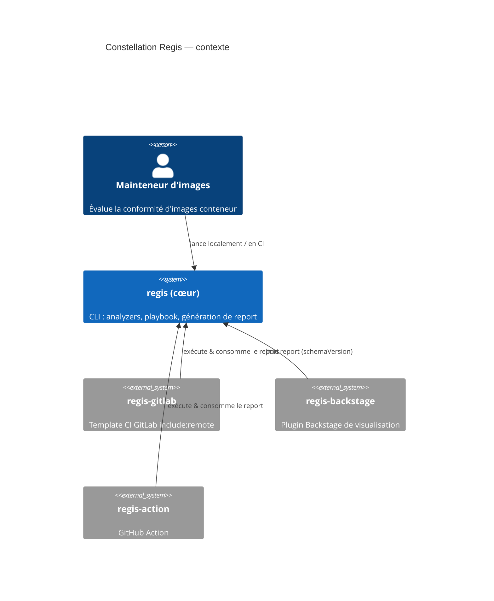

# Gouvernance de la mémoire — constellation Regis : plan d'implémentation

> **For agentic workers:** REQUIRED SUB-SKILL: Use superpowers:subagent-driven-development (recommended) or superpowers:executing-plans to implement this plan task-by-task. Steps use checkbox (`- [ ]`) syntax for tracking.

**Goal:** Mettre en place une gouvernance unique de la mémoire de projet : `.agent/rules/` comme source de vérité **unique** des conventions, une zone « constellation » dans le cœur pour le contrat + le glossaire, et un cycle de vie où les plans d'exécution ne survivent pas au merge.

**Architecture:** Travail éditorial/migration de documentation (pas de code applicatif). On déduplique les conventions (3 copies → 1, dans `.agent/rules/`), on crée `docs/memory-bank/constellation/{contract,glossary,README}.md`, on trie l'ancien `docs/memory-bank/plans/`, et on réduit `CLAUDE.md` + `systemPatterns.md` à des pointeurs. Le branchement des sous-projets se fait dans leurs dépôts via des PR séparées.

**Tech Stack:** Markdown, Mermaid (C4), git. Vérifications par `grep`/`test` shell (pas de pytest — aucun code n'est touché). Pré-commit Trunk auto-formate au commit ; les blocs de code fenced doivent porter un langage (MD040).

**Référence spec :** `docs/superpowers/specs/2026-06-08-memory-governance-constellation-design.md`

> **Méta-note :** ce plan est lui-même un plan d'exécution. Conformément à la décision D5, il est **supprimé au merge** (dernière tâche).

> ⚠️ **Garde-fou permanent (toutes tâches) :** `docs/memory-bank/plans/gitlab-ci-pipeline-improvements-plan.md` est un fichier **non tracké** touchant le CI client confidentiel. Ne **jamais** le `git add`, le commiter, ni le supprimer dans une opération git. Toute commande `git add`/`git rm` doit nommer explicitement ses fichiers — jamais `git add -A` ni de glob large.

---

## Structure des fichiers

**Source de vérité des conventions (mise à jour, pas créée) :**
- `.agent/rules/commitmessages.md` — scopes alignés sur le code réel (corrige la dérive)
- `.agent/rules/documentation.md` — retire « Antora » (Docusaurus uniquement)

**Créés (cœur `regis`) :**
- `docs/memory-bank/constellation/contract.md` — normatif inter-repos
- `docs/memory-bank/constellation/glossary.md` — vocabulaire + C4
- `docs/memory-bank/constellation/README.md` — carte de la zone

**Modifiés (cœur `regis`) :**
- `docs/memory-bank/systemPatterns.md` — liste de scopes → pointeur ; + section taxonomie
- `docs/memory-bank/decisionLog.md` — promotion des notes de probe
- `CLAUDE.md` — emplacement des plans, règle « supprimés au merge », pointeurs `.agent/rules/` + constellation
- `docs/superpowers/specs/2026-05-22-docker-image-size-reduction-design.md` — design déplacé ici

**Supprimés (cœur `regis`) :**
- `docs/superpowers/plans/2026-05-29-regctl-probe-notes.md` (après promotion)
- `docs/superpowers/plans/2026-05-30-grype-probe-notes.md` (après promotion)
- Les plans mergés de `docs/memory-bank/plans/` (liste en Tâche 6)

**Hors de ce worktree (PR séparées) :**
- `regis-backstage/CLAUDE.md`, `regis-gitlab/CLAUDE.md` — bloc « Mémoire transverse » (Tâche 9)

---

## Tâche 1 : `.agent/rules/` devient la source de vérité des conventions

**Files:**
- Modify: `.agent/rules/commitmessages.md`, `.agent/rules/documentation.md`
- Source qui fait foi : `docs/memory-bank/systemPatterns.md:66-87` (liste de scopes à jour) + `pyproject.toml:29-41` (analyzers réels)

- [ ] **Étape 1 : Confirmer la liste de scopes à jour**

Run: `sed -n '66,98p' docs/memory-bank/systemPatterns.md`
Objectif : `systemPatterns.md` fait foi (à jour : `analyzer/cve` via grype, `analyzer/secrets` via trufflehog, `analyzer/sbom` via syft, `analyzer/dockle`). C'est cette liste qu'on porte dans `.agent/rules/`.

- [ ] **Étape 2 : Corriger la section « Defined Scopes » de `commitmessages.md`**

Dans `.agent/rules/commitmessages.md`, remplacer la liste périmée de la section
`## Defined Scopes` par celle alignée sur `systemPatterns.md` :

```markdown
### Core & Logic

- `cli` : Command-line interface, argument parsing, main console output.
- `playbook` : Rule evaluation engine, section parsing, `jsonLogic`, context management.
- `schema` : Data interfaces, structure definitions, JSON validation files (`*.schema.json`).
- `registry` : Registry communication layer (HTTP, authentication, manifest fetching).

### Analyzers

- `analyzer` : Base analyzer class or shared analyzer interfaces.
- `analyzer/cve` : Vulnerability (CVE) scanning via grype.
- `analyzer/secrets` : Embedded secret detection via trufflehog.
- `analyzer/sbom` : SBOM analysis and CycloneDX/SPDX generation via syft.
- `analyzer/hadolint` : Dockerfile linting.
- `analyzer/dockle` : Container image linting / best practices.
- `analyzer/skopeo` : Base metadata extraction.
- `analyzer/freshness` : Image age and freshness score.
- `analyzer/size` : Size and layer calculations.
- `analyzer/popularity` : Registry popularity metrics.
- `analyzer/endoflife` : Version support status.
- `analyzer/scorecarddev` : OpenSSF Scorecard checks.
- `analyzer/provenance` : Provenance and supply-chain evidence.

### Rendering & Reporting

- `report` : High-level report generation (folder creation, file writing).
- `templates` (or `theme`) : Visual aspects, HTML, CSS, React/Docusaurus SPA.

### Tooling & CI

- `ci` : GitHub Actions workflows.
- `deps` (or `build`) : Environment management (Pipenv, pyproject.toml, Dockerfiles).
- `docs` : Docusaurus documentation, READMEs, and Memory Bank updates.
```

(Changements clés : `analyzer/trivy` → `analyzer/cve` + `analyzer/secrets`/`sbom` ; ajout `analyzer/dockle` ; « Jinja2 macros » → « React/Docusaurus SPA » ; « Antora » → « Docusaurus ».)

- [ ] **Étape 3 : Corriger `.agent/rules/documentation.md`**

Le fichier mentionne à la fois Antora et Docusaurus. Garder Docusaurus, retirer la
ligne Antora. Run pour repérer : `grep -n "Antora" .agent/rules/documentation.md`
Supprimer/réécrire la ligne fautive pour ne plus citer Antora.

- [ ] **Étape 4 : Vérifier qu'aucune dérive connue ne subsiste**

Run: `grep -rin "trivy\|antora\|jinja" .agent/rules/`
Expected: aucune sortie.

- [ ] **Étape 5 : Commit**

```bash
git add .agent/rules/commitmessages.md .agent/rules/documentation.md
git commit -m "docs: make .agent/rules the single source of truth for conventions"
```

---

## Tâche 2 : Réduire `systemPatterns.md` à un pointeur + documenter la taxonomie

**Files:**
- Modify: `docs/memory-bank/systemPatterns.md` (remplacer la liste de scopes par un pointeur ; ajouter la section taxonomie)

- [ ] **Étape 1 : Remplacer la section « Commit Scopes » par un pointeur**

Remplacer tout le bloc `## Commit Scopes (mandatory)` (et sa liste détaillée) par :

```markdown
## Commit Scopes (mandatory)

> Source de vérité unique : `.agent/rules/commitmessages.md` (auto-chargé par les
> agents). Extrapoler le scope du composant architectural modifié. Ne pas redupliquer
> la liste ici.
```

- [ ] **Étape 2 : Ajouter la section taxonomie (juste avant le pointeur ci-dessus)**

```markdown
## Mémoire & artefacts de planification — taxonomie

Tout artefact de mémoire se range selon deux axes : **portée** (local à un repo /
constellation transverse) et **durée de vie** (durable / éphémère).

|                   | Durable                                                             | Éphémère                                 |
| ----------------- | ------------------------------------------------------------------ | ---------------------------------------- |
| **Local**         | memory-bank du repo + specs (`docs/superpowers/specs/`)            | plans d'exécution → supprimés au merge   |
| **Constellation** | conventions (`.agent/rules/`) + `docs/memory-bank/constellation/` | état programme → mémoire auto de l'agent |

Règle mentale : _« Est-ce vrai pour toute la constellation ? → cœur. Est-ce que ça
survit à la PR ? → memory-bank/spec, sinon plan jetable. »_

- Une **note de recherche** (probe, benchmark, « pourquoi on a écarté X ») est durable :
  la promouvoir vers `decisionLog.md` avant de supprimer le plan qui l'hébergeait.
- Les sous-projets ne dupliquent pas la zone constellation : ils y renvoient par lien.
```

- [ ] **Étape 3 : Vérifier qu'il ne reste qu'une copie de la liste de scopes**

Run: `grep -rl 'analyzer/freshness' .agent/ docs/memory-bank/`
Expected: uniquement `.agent/rules/commitmessages.md` (la liste détaillée a disparu de systemPatterns).

- [ ] **Étape 4 : Commit**

```bash
git add docs/memory-bank/systemPatterns.md
git commit -m "docs: point systemPatterns to .agent/rules and add memory taxonomy"
```

---

## Tâche 3 : Créer `constellation/glossary.md`

**Files:**
- Create: `docs/memory-bank/constellation/glossary.md`
- Source : `docs/memory-bank/decisionLog.md:5` (modèle 4-couches), architecture C4 du produit éclaté

- [ ] **Étape 1 : Écrire le fichier**

Créer `docs/memory-bank/constellation/glossary.md` :

````markdown
# Glossaire & modèle mental — constellation Regis

> Vocabulaire partagé. En cas de divergence avec le code, le code fait foi —
> signalez l'écart pour mettre ce fichier à jour.

## Le produit est éclaté

« Regis » n'est pas un dépôt : c'est un cœur (`regis`) plus des intégrations qui
consomment son contrat de rapport.



## Le modèle de vocabulaire à quatre couches

Le mot « rule » était surchargé. Il est désormais désambiguïsé en quatre couches
(décision 2026-06-05) :

| Couche        | Sens                                                                                  |
| ------------- | ------------------------------------------------------------------------------------- |
| **finding**   | une détection locale d'un problème par un analyzer (terme local).                     |
| **metric**    | un agrégat exposé par un analyzer (`results.*`), ce que les critères lisent.          |
| **criterion** | une condition réutilisable et paramétrée livrée par un analyzer (ex `cve-count`). Anciennement « default rule »/template. Espace JSON Logic : `criterion.params`. |
| **rule**      | la décision de politique liée au playbook : criterion + options + severity + tier.    |

Termes voisins :

- **component** (SBOM) — un élément d'inventaire ; explicitement **pas** un finding.
- **check** — réservé à la commande `regis check` ; **ne pas** l'employer pour « criterion » (collision).

## Autres termes

- **analyzer** — plugin (`BaseAnalyzer`) qui produit findings + metrics + critères par défaut. Enregistré via `project.entry-points."regis.analyzers"`.
- **playbook** — document YAML (enveloppe Kubernetes-style `apiVersion`/`kind`/`metadata`/`spec`) qui lie des critères en règles et décrit la présentation.
- **presentation** — section neutre `spec.presentation` d'un playbook (ex-`spec.integrations.gitlab`), pilotant le rendu/identité du report.
- **report** — sortie sérialisée versionnée par `schemaVersion` ; le contrat que les intégrations consomment (voir `contract.md`).
````

- [ ] **Étape 2 : Valider le Mermaid**

Run: `grep -c "C4Context" docs/memory-bank/constellation/glossary.md`
Expected: `1`. Optionnellement, rendre le diagramme via l'outil Mermaid pour confirmer qu'il compile.

- [ ] **Étape 3 : Commit**

```bash
git add docs/memory-bank/constellation/glossary.md
git commit -m "docs: add shared glossary and C4 context to constellation zone"
```

---

## Tâche 4 : Créer `constellation/contract.md`

**Files:**
- Create: `docs/memory-bank/constellation/contract.md`
- Sources : `regis/utils/report.py` (`REPORT_SCHEMA_VERSION`), `regis/schemas/report/report.schema.json`, `regis/schemas/playbook/` (presentation), `pyproject.toml:29-41` (entry points)

- [ ] **Étape 1 : Vérifier les valeurs courantes avant d'écrire**

Run:
```bash
grep -n "REPORT_SCHEMA_VERSION" regis/utils/report.py
grep -rn "presentation" regis/schemas/playbook/
sed -n '29,41p' pyproject.toml
```
Expected : `REPORT_SCHEMA_VERSION = 2` ; un schéma `presentation` côté playbook ; 12 entry points analyzer. **Reporter les valeurs réelles observées** dans le fichier ci-dessous.

- [ ] **Étape 2 : Écrire le fichier**

Créer `docs/memory-bank/constellation/contract.md` (ajuster les valeurs selon l'étape 1) :

```markdown
# Contrat inter-repos — constellation Regis

> NORMATIF. Tout sous-projet qui sérialise ou consomme un report DOIT respecter ce
> contrat. **À lire avant toute modification touchant la sérialisation/consommation
> d'un report.** En cas de conflit entre ce fichier et le code du cœur, le code fait
> foi — ouvrez une PR pour réaligner ce fichier.

## Report schema

- **Version courante : `REPORT_SCHEMA_VERSION = 2`** (`regis/utils/report.py`).
- Le report sérialisé porte `schemaVersion` ; `ensure_schema_version()` le garantit.
- Schéma : `regis/schemas/report/report.schema.json`.
- **Politique de bump** : tout changement cassant de structure du report incrémente
  `REPORT_SCHEMA_VERSION`. Les consommateurs (`regis-backstage`, `regis-gitlab`,
  `regis-action`) lisent `schemaVersion` et doivent gérer le refus/avertissement sur
  version inconnue. Annoncer tout bump dans la PR du cœur et avertir les sous-projets.

## Presentation

- Section neutre **`spec.presentation`** du playbook (ex-`spec.integrations.gitlab`,
  généralisée le 2026-06-06). Schéma : `regis/schemas/playbook/`.
- Les champs report liés à la présentation sont neutres (non couplés à un fournisseur CI).

## Analyzers (entry points)

Les analyzers sont découverts via `project.entry-points."regis.analyzers"`
(`pyproject.toml`). Un sous-projet qui ajoute un analyzer s'enregistre par ce mécanisme.
Liste courante (12) : `versioning`, `scorecarddev`, `oci`, `cve`, `endoflife`,
`popularity`, `size`, `freshness`, `provenance`, `sbom`, `hadolint`, `dockle`.

## Vocabulaire & conventions

- Termes : voir `glossary.md` (finding → metric → criterion → rule).
- Conventions de travail (commits, branches, style) : voir `.agent/rules/` du cœur.
```

- [ ] **Étape 3 : Vérifier l'alignement de version**

Run: `grep -q "REPORT_SCHEMA_VERSION = $(grep -oE 'REPORT_SCHEMA_VERSION = [0-9]+' regis/utils/report.py | grep -oE '[0-9]+')" docs/memory-bank/constellation/contract.md && echo "version alignée"`
Expected: `version alignée`

- [ ] **Étape 4 : Commit**

```bash
git add docs/memory-bank/constellation/contract.md
git commit -m "docs: add inter-repo contract to constellation memory zone"
```

---

## Tâche 5 : Créer `constellation/README.md` (la carte)

**Files:**
- Create: `docs/memory-bank/constellation/README.md`

- [ ] **Étape 1 : Écrire le fichier**

Créer `docs/memory-bank/constellation/README.md` :

```markdown
# Zone constellation — mémoire transverse Regis

Savoir partagé par tous les dépôts de la constellation (`regis`, `regis-backstage`,
`regis-gitlab`, `regis-action`). La zone est **logique**, répartie sur deux emplacements :

| Sujet                     | Où                                                |
| ------------------------- | ------------------------------------------------- |
| Conventions de travail    | `.agent/rules/` (cœur, auto-chargé par les agents) |
| Contrat inter-repos       | `docs/memory-bank/constellation/contract.md`      |
| Glossaire & modèle mental | `docs/memory-bank/constellation/glossary.md`      |
| État programme (vivant)   | mémoire auto de l'agent (non versionné)           |

Les sous-projets ne dupliquent rien : leur `CLAUDE.md` pointe ici.
```

- [ ] **Étape 2 : Vérifier la zone complète**

Run: `ls docs/memory-bank/constellation/`
Expected: `README.md  contract.md  glossary.md`

- [ ] **Étape 3 : Commit**

```bash
git add docs/memory-bank/constellation/README.md
git commit -m "docs: add constellation zone map (README)"
```

---

## Tâche 6 : Promouvoir les notes de probe, puis les supprimer

**Files:**
- Modify: `docs/memory-bank/decisionLog.md`
- Delete: `docs/superpowers/plans/2026-05-29-regctl-probe-notes.md`, `docs/superpowers/plans/2026-05-30-grype-probe-notes.md`

- [ ] **Étape 1 : Relire les conclusions des probes**

Run:
```bash
sed -n '1,40p' docs/superpowers/plans/2026-05-29-regctl-probe-notes.md
sed -n '1,40p' docs/superpowers/plans/2026-05-30-grype-probe-notes.md
```
Extraire les **conclusions durables** (versions figées, formes de sortie verrouillées, fixtures), pas le détail d'investigation.

- [ ] **Étape 2 : Ajouter deux entrées dans `decisionLog.md`**

Insérer juste après `# Decision Log` (avant `## 2026-06-05`), au format existant :

```markdown
## 2026-05-30: Probe — grype/syft/trufflehog output shapes locked

- **Decision**: Migration trivy→grype/syft/trufflehog parse des formes de sortie
  vérifiées empiriquement. Fixtures de référence capturées sous `tests/fixtures/`.
- **Reference**: notes de probe (supprimées au merge ; trace dans la PR de migration grype).

## 2026-05-29: Probe — regctl output shapes locked

- **Decision**: Migration skopeo→regctl figée sur regctl v0.11.5 ; formes de sortie
  (index multi-arch, config blob) verrouillées via fixtures `tests/fixtures/regctl/`.
- **Reference**: notes de probe (supprimées au merge ; trace dans la PR de migration regctl).
```

> Ajuster les versions/chemins réellement lus à l'étape 1.

- [ ] **Étape 3 : Supprimer les fichiers de probe**

```bash
git rm docs/superpowers/plans/2026-05-29-regctl-probe-notes.md docs/superpowers/plans/2026-05-30-grype-probe-notes.md
```

- [ ] **Étape 4 : Vérifier**

Run: `grep -c "Probe —" docs/memory-bank/decisionLog.md`
Expected: `2`

- [ ] **Étape 5 : Commit**

```bash
git add docs/memory-bank/decisionLog.md
git commit -m "docs: promote probe notes into decisionLog, drop the plan files"
```

---

## Tâche 7 : Trier `docs/memory-bank/plans/`

**Files:**
- Move: `docs/memory-bank/plans/2026-05-22-docker-image-size-reduction-design.md` → `docs/superpowers/specs/`
- Delete (plans mergés, tracés) : liste ci-dessous
- Leave untouched: `docs/memory-bank/plans/gitlab-ci-pipeline-improvements-plan.md` (NON TRACKÉ — garde-fou)

| Fichier                                                 | Sort                                  |
| ------------------------------------------------------- | ------------------------------------- |
| `2026-05-22-docker-image-size-reduction-design.md`      | **déplacer → specs/** (design)        |
| `2026-04-25-html-single-file-report.md`                 | supprimer (mergé ; design déjà en specs/) |
| `2026-05-22-docker-image-size-reduction-plan.md`        | supprimer (mergé)                     |
| `2026-05-29-docker-image-size-reduction-round2-plan.md` | supprimer (mergé)                     |
| `2026-05-31-image-size-round-3-plan.md`                 | supprimer (mergé ; design en specs/)  |
| `2026-06-05-rename-rule-to-criterion-plan.md`           | supprimer (mergé, PR #646)            |
| `ci-cd-hardening-plan.md`                               | supprimer (mergé)                     |
| `create-playbook-skill.md`                              | supprimer (skill retirée, #648)       |
| `github-action-extraction-plan.md`                      | supprimer (mergé)                     |
| `playbook-kubernetes-kinds-plan.md`                     | supprimer (mergé ; design en specs/)  |
| `validation-mr-pipeline-plan.md`                        | supprimer (mergé)                     |
| `m002-s05-dependency-upgrade-plan.md`                   | voir étape 2 (completion record)      |
| `gitlab-ci-pipeline-improvements-plan.md`               | **NE PAS TOUCHER** (non tracké, CI client) |

- [ ] **Étape 1 : Déplacer le design mal rangé**

```bash
git mv docs/memory-bank/plans/2026-05-22-docker-image-size-reduction-design.md docs/superpowers/specs/2026-05-22-docker-image-size-reduction-design.md
```

- [ ] **Étape 2 : Traiter le completion record `m002-s05`**

Run: `grep -in "M001\|M002\|S05\|dependency upgrade" docs/memory-bank/progress.md`
- Si `progress.md` couvre déjà ce sprint → `git rm docs/memory-bank/plans/m002-s05-dependency-upgrade-plan.md`
- Sinon → en résumer l'essentiel (1-3 lignes) dans `progress.md` puis supprimer le fichier.

- [ ] **Étape 3 : Supprimer les plans mergés (chemins explicites, jamais de glob)**

```bash
git rm \
  docs/memory-bank/plans/2026-04-25-html-single-file-report.md \
  docs/memory-bank/plans/2026-05-22-docker-image-size-reduction-plan.md \
  docs/memory-bank/plans/2026-05-29-docker-image-size-reduction-round2-plan.md \
  docs/memory-bank/plans/2026-05-31-image-size-round-3-plan.md \
  docs/memory-bank/plans/2026-06-05-rename-rule-to-criterion-plan.md \
  docs/memory-bank/plans/ci-cd-hardening-plan.md \
  docs/memory-bank/plans/create-playbook-skill.md \
  docs/memory-bank/plans/github-action-extraction-plan.md \
  docs/memory-bank/plans/playbook-kubernetes-kinds-plan.md \
  docs/memory-bank/plans/validation-mr-pipeline-plan.md
```

- [ ] **Étape 4 : Vérifier que seul le fichier non tracké subsiste**

Run: `git ls-files docs/memory-bank/plans/ | wc -l` → Expected: `0`
Run: `ls docs/memory-bank/plans/` → Expected: seulement `gitlab-ci-pipeline-improvements-plan.md` (intact)

- [ ] **Étape 5 : Commit**

```bash
git add docs/superpowers/specs/2026-05-22-docker-image-size-reduction-design.md docs/memory-bank/progress.md
git commit -m "docs: relocate stray design to specs and drop merged plans"
```

---

## Tâche 8 : Mettre à jour `regis/CLAUDE.md`

**Files:**
- Modify: `CLAUDE.md`

- [ ] **Étape 1 : Corriger l'emplacement des plans (ligne 11)**

Remplacer :

```text
Plans live in `docs/memory-bank/plans/<task-slug>-plan.md` — never at repo root.
```

par :

```text
Les **specs** vivent dans `docs/superpowers/specs/`, les **plans** d'exécution dans `docs/superpowers/plans/` — jamais à la racine. Les plans sont **supprimés au merge** (squash) ; seuls specs et notes de recherche promues survivent. Taxonomie : `docs/memory-bank/systemPatterns.md`.
```

- [ ] **Étape 2 : Réduire les conventions dupliquées à des pointeurs**

Dans la section « Commit messages » (et « Style guides » si dupliqué), remplacer le
détail par un pointeur :

```text
> Conventions transverses (scopes, branches, skills, style) : source unique dans `.agent/rules/` (auto-chargé) ; contrat + glossaire dans `docs/memory-bank/constellation/`. Ce `CLAUDE.md` ne garde que le détail propre au cœur.
```

- [ ] **Étape 3 : Vérifier qu'aucune référence périmée ne subsiste**

Run: `grep -n "memory-bank/plans" CLAUDE.md`
Expected: aucune sortie.

- [ ] **Étape 4 : Commit**

```bash
git add CLAUDE.md
git commit -m "docs: align CLAUDE.md with plan lifecycle and constellation pointers"
```

---

## Tâche 9 : Brancher les sous-projets (PR séparées, hors de ce worktree)

> Ces changements vivent dans **d'autres dépôts**. Les exécuter dans un clone à jour de
> chaque sous-projet, sur une branche dédiée, avec sa propre PR. `regis-action` n'est
> pas sur le disque → à faire à sa (re)création.

- [ ] **Étape 1 : `regis-backstage/CLAUDE.md`**

Ajouter le bloc :
```markdown
## Mémoire transverse (constellation Regis)

Conventions de travail (auto-chargées) :
https://github.com/trivoallan/regis/tree/main/.agent/rules/
Contrat inter-repos, glossaire :
https://github.com/trivoallan/regis/tree/main/docs/memory-bank/constellation/
Lis `contract.md` AVANT toute modification touchant la sérialisation/consommation d'un report.
Ce CLAUDE.md ne contient que le spécifique à CE repo.
```
Puis retirer de ce `CLAUDE.md` les conventions désormais centralisées (scopes, workflow,
skills). Ne **pas** créer de `.agent/rules/` ici (YAGNI). Commit : `docs: point to shared constellation memory`.

- [ ] **Étape 2 : `regis-gitlab/CLAUDE.md`**

Même bloc et même nettoyage. `regis-gitlab` est dual-host (origin gitlab.com, miroir
github.com) ; le lien HTTP absolu vers GitHub fonctionne depuis le clone gitlab.

- [ ] **Étape 3 : Vérifier (dans chaque sous-projet)**

Run: `grep -c "constellation/" CLAUDE.md`
Expected: `1`

---

## Tâche 10 : Vérification finale & auto-suppression du plan

**Files:**
- Delete: ce plan (`docs/superpowers/plans/2026-06-08-memory-governance-constellation.md`)

- [ ] **Étape 1 : Vérifications de cohérence (cœur)**

```bash
test -f docs/memory-bank/constellation/contract.md && \
test -f docs/memory-bank/constellation/glossary.md && \
test -f docs/memory-bank/constellation/README.md && echo "zone OK"
grep -rin "trivy\|antora\|jinja" .agent/rules/ || echo ".agent/rules propre"
grep -rl 'analyzer/freshness' .agent/ docs/memory-bank/   # attendu : seul .agent/rules/commitmessages.md
git ls-files docs/memory-bank/plans/ | wc -l               # attendu : 0
test -f docs/memory-bank/plans/gitlab-ci-pipeline-improvements-plan.md && echo "fichier client intact"
grep -rn "memory-bank/plans" CLAUDE.md || echo "CLAUDE.md propre"
```
Expected : `zone OK`, `.agent/rules propre`, une seule copie de la liste de scopes, `0`, `fichier client intact`, `CLAUDE.md propre`.

- [ ] **Étape 2 : Lancer les linters**

Run: `trunk check --filter=markdownlint,prettier .agent/rules/ docs/memory-bank/constellation/ CLAUDE.md docs/memory-bank/systemPatterns.md docs/memory-bank/decisionLog.md`
Expected: no issues (ou auto-fix appliqué — recommiter le cas échéant).

- [ ] **Étape 3 : Supprimer ce plan (décision D5 — les plans ne survivent pas au merge)**

```bash
git rm docs/superpowers/plans/2026-06-08-memory-governance-constellation.md
git commit -m "docs: drop the migration plan (executed) per merge-time rule"
```

- [ ] **Étape 4 : Ouvrir la PR**

PR vers `main` du cœur. Corps : résumer la nouvelle gouvernance (3 copies de conventions
→ 1 dans `.agent/rules/`, zone constellation, plans supprimés au merge), référencer le
spec. Lister la Tâche 9 comme suivi dans les sous-projets.

---

## Self-review (couverture spec)

- D1 (cœur source de vérité) → Tâches 1-5 ✔
- D2 (`.agent/rules/` source unique des conventions, dédup + dérive corrigée) → Tâches 1, 2, 8 ✔
- D3 (zone constellation contract/glossary/README) → Tâches 3, 4, 5 ✔
- D4 (état programme en mémoire auto, pas de `program.md`) → aucune tâche n'en crée ✔
- D5 (deux lieux, plans supprimés au merge, `memory-bank/plans/` disparaît) → Tâches 7, 8, 10 ✔
- D6 (notes de recherche promues) → Tâche 6 ✔
- D7 (branchement sous-projets vers `.agent/rules/` + constellation) → Tâche 9 ✔
- Taxonomie documentée → Tâche 2 ✔
- Garde-fou fichier CI client non tracké → présent dans toutes les tâches concernées ✔
- Pas de 4ᵉ copie (`conventions.md`) créée → confirmé (aucune tâche ne le crée) ✔
