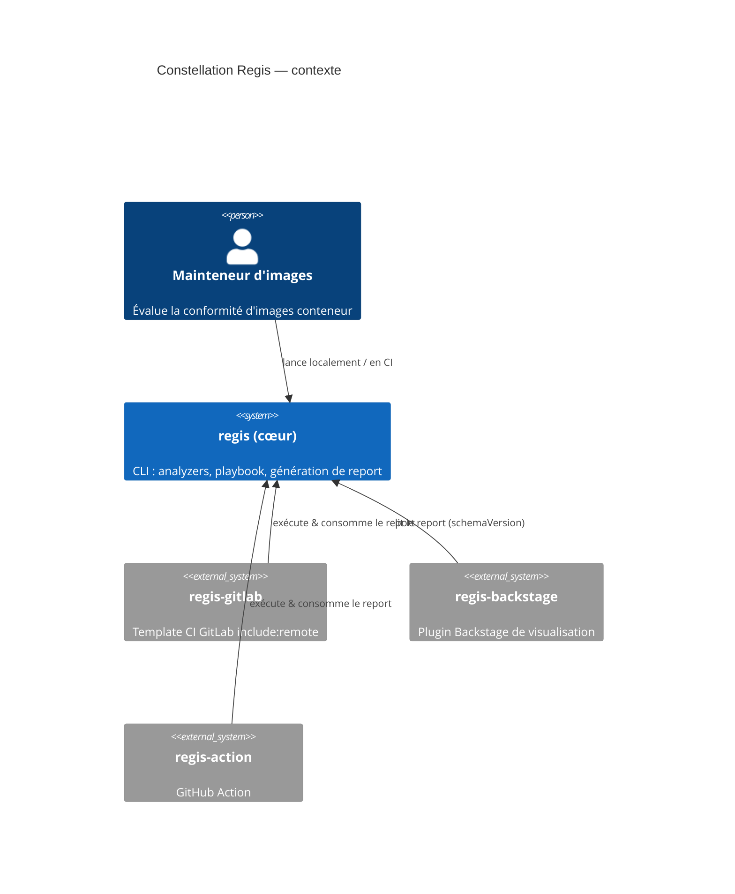

# Gouvernance de la mémoire — constellation Regis : plan d'implémentation

> **For agentic workers:** REQUIRED SUB-SKILL: Use superpowers:subagent-driven-development (recommended) or superpowers:executing-plans to implement this plan task-by-task. Steps use checkbox (`- [ ]`) syntax for tracking.

**Goal:** Mettre en place une gouvernance unique de la mémoire de projet : une zone « constellation » dans le cœur `regis` comme source de vérité transverse, et un cycle de vie clair où les plans d'exécution ne survivent pas au merge.

**Architecture:** Travail éditorial/migration de documentation (pas de code applicatif). On crée `docs/memory-bank/constellation/{contract,conventions,glossary}.md`, on consolide les conventions dispersées, on trie l'ancien `docs/memory-bank/plans/`, et on aligne `CLAUDE.md` + `systemPatterns.md`. Le branchement des sous-projets (`regis-backstage`, `regis-gitlab`) se fait dans leurs propres dépôts via des PR séparées.

**Tech Stack:** Markdown, Mermaid (C4), git. Vérifications par `grep`/`test` shell (pas de pytest — aucun code n'est touché). Pré-commit Trunk auto-formate au commit.

**Référence spec :** `docs/superpowers/specs/2026-06-08-memory-governance-constellation-design.md`

> **Méta-note :** ce plan est lui-même un plan d'exécution. Conformément à la décision D4, il est **supprimé au merge** (Tâche 9, étape finale).

> ⚠️ **Garde-fou permanent (toutes tâches) :** `docs/memory-bank/plans/gitlab-ci-pipeline-improvements-plan.md` est un fichier **non tracké** touchant le CI client confidentiel. Ne **jamais** le `git add`, le commiter, ni le supprimer dans une opération git. Toute commande `git add` doit nommer explicitement ses fichiers — jamais `git add -A` ni `git add docs/`.

---

## Structure des fichiers

**Créés (cœur `regis`) :**

- `docs/memory-bank/constellation/contract.md` — normatif inter-repos
- `docs/memory-bank/constellation/conventions.md` — conventions de travail partagées
- `docs/memory-bank/constellation/glossary.md` — vocabulaire + C4

**Modifiés (cœur `regis`) :**

- `docs/memory-bank/decisionLog.md` — promotion des notes de probe
- `docs/memory-bank/systemPatterns.md` — section taxonomie
- `CLAUDE.md` — emplacement des plans, règle « supprimés au merge », pointeur constellation
- `docs/superpowers/specs/2026-05-22-docker-image-size-reduction-design.md` — design déplacé ici

**Supprimés (cœur `regis`) :**

- `docs/superpowers/plans/2026-05-29-regctl-probe-notes.md` (après promotion)
- `docs/superpowers/plans/2026-05-30-grype-probe-notes.md` (après promotion)
- Les plans mergés de `docs/memory-bank/plans/` (liste en Tâche 5)

**Hors de ce worktree (PR séparées) :**

- `regis-backstage/CLAUDE.md`, `regis-gitlab/CLAUDE.md` — bloc « Mémoire transverse » (Tâche 8)

---

## Tâche 1 : Créer `constellation/conventions.md`

**Files:**

- Create: `docs/memory-bank/constellation/conventions.md`
- Source de vérité : `docs/memory-bank/systemPatterns.md:62-98` (commit scopes), `CLAUDE.md` (workflow + craftsmanship)

- [ ] **Étape 1 : Écrire le fichier**

Créer `docs/memory-bank/constellation/conventions.md` avec ce contenu :

```markdown
# Conventions de travail — constellation Regis

> Source de vérité partagée par tous les dépôts de la constellation
> (`regis`, `regis-backstage`, `regis-gitlab`, `regis-action`).
> Les `CLAUDE.md` locaux ne contiennent que le spécifique à leur repo et pointent ici.

## Commits — Conventional Commits + Angular type list

- **Scope obligatoire**, extrapolé du composant architectural modifié.
- Description : style impératif (Google Blockly commit guide), aspect fonctionnel d'abord.

### Scopes (cœur)

| Scope                 | Périmètre                                                       |
| --------------------- | --------------------------------------------------------------- |
| `cli`                 | CLI, parsing d'arguments, sortie console principale             |
| `playbook`            | moteur d'évaluation, parsing de sections, `jsonLogic`, contexte |
| `schema`              | interfaces de données, structures, fichiers de validation JSON  |
| `registry`            | communication registry (HTTP, auth, fetch de manifestes)        |
| `analyzer`            | classe de base ou interfaces partagées des analyzers            |
| `analyzer/*`          | un analyzer précis (`analyzer/cve`, `analyzer/sbom`, …)         |
| `report`              | génération de rapport (création de dossiers, écriture)          |
| `templates` / `theme` | HTML, CSS, SPA React/Docusaurus                                 |
| `ci`                  | workflows GitHub Actions                                        |
| `deps` / `build`      | environnement (Pipenv, pyproject.toml, Dockerfiles)             |
| `docs`                | documentation, READMEs, mises à jour Memory Bank                |

> Liste exhaustive des scopes analyzer : voir `systemPatterns.md` du cœur.

## Branches & intégration

- Branches feature/bug → PR → `main`. `main` est protégé.
- **Toujours rebaser** sur `main` (jamais de merge-back) — historique linéaire.
- Brancher depuis le dernier `main` juste avant de commiter (évite le piège rebase + squash no-op).
- Merge final en **squash** : les plans d'exécution ajoutés puis retirés ne polluent jamais `main`.

## Cycle de vie des artefacts de mémoire

Voir la taxonomie dans `systemPatterns.md` (cœur). En résumé :

- **Specs** (`docs/superpowers/specs/`) — durables, le « quoi/pourquoi ». Conservés.
- **Plans** (`docs/superpowers/plans/`) — éphémères, le « comment ». **Supprimés au merge.**
- **Notes de recherche** (probes, benchmarks) — durables → promues vers `decisionLog.md`, jamais supprimées avec le plan qui les hébergeait.

## Stack de skills

Workflow spec-driven à skills empilées : Superpowers (`/brainstorming`, `/writing-plans`,
`/executing-plans`, TDD, debugging systématique) composé avec les skills projet
(`/verify`, `/code-review`, `/init`). Quand une tâche récurrente n'a pas de skill, en
créer une (`/skill-authoring`) plutôt que ré-improviser.

## Style guides

- [Google Python Style Guide](https://google.github.io/styleguide/pyguide.html) — type hints requis.
- [Google HTML/CSS Style Guide](https://google.github.io/styleguide/htmlcssguide.html)
- [Google developer documentation style guide](https://developers.google.com/style)
- Diagrammes en **Mermaid** ; diagrammes d'architecture en **C4**.
- Préférer des bibliothèques établies à du code maison ; préférer Python aux langages ECMAScript quand c'est possible.
```

- [ ] **Étape 2 : Vérifier la cohérence des scopes avec la source**

Run: `diff <(grep -oE '^- \`[a-z/]+\`' docs/memory-bank/systemPatterns.md | sort -u) <(grep -oE '\| \`[a-z/*]+\`' docs/memory-bank/constellation/conventions.md | sort -u) || echo "revue manuelle : scopes alignés ?"`
Expected: pas de scope manquant côté conventions (revue visuelle si le format diffère).

- [ ] **Étape 3 : Commit**

```bash
git add docs/memory-bank/constellation/conventions.md
git commit -m "docs: add shared conventions to constellation memory zone"
```

---

## Tâche 2 : Créer `constellation/glossary.md`

**Files:**

- Create: `docs/memory-bank/constellation/glossary.md`
- Source : `docs/memory-bank/decisionLog.md:5` (modèle 4-couches), architecture C4 du produit éclaté

- [ ] **Étape 1 : Écrire le fichier**

Créer `docs/memory-bank/constellation/glossary.md` :

````markdown
# Glossaire & modèle mental — constellation Regis

> Vocabulaire partagé. En cas de divergence avec le code, le code fait foi —
> signalez l'écart pour mettre ce fichier à jour.

## Le produit est éclaté

« Regis » n'est pas un dépôt : c'est un cœur (`regis`) plus des intégrations qui
consomment son contrat de rapport.



## Le modèle de vocabulaire à quatre couches

Le mot « rule » était surchargé. Il est désormais désambiguïsé en quatre couches
(décision 2026-06-05) :

| Couche        | Sens                                                                                                                                                              |
| ------------- | ----------------------------------------------------------------------------------------------------------------------------------------------------------------- |
| **finding**   | une détection locale d'un problème par un analyzer (terme local).                                                                                                 |
| **metric**    | un agrégat exposé par un analyzer (`results.*`), ce que les critères lisent.                                                                                      |
| **criterion** | une condition réutilisable et paramétrée livrée par un analyzer (ex `cve-count`). Anciennement « default rule »/template. Espace JSON Logic : `criterion.params`. |
| **rule**      | la décision de politique liée au playbook : criterion + options + severity + tier.                                                                                |

Termes voisins :

- **component** (SBOM) — un élément d'inventaire ; explicitement **pas** un finding.
- **check** — réservé à la commande `regis check` ; **ne pas** l'employer pour « criterion » (collision).

## Autres termes

- **analyzer** — plugin (`BaseAnalyzer`) qui produit findings + metrics + critères par défaut. Enregistré via `project.entry-points."regis.analyzers"`.
- **playbook** — document YAML (enveloppe Kubernetes-style `apiVersion`/`kind`/`metadata`/`spec`) qui lie des critères en règles et décrit la présentation.
- **presentation** — section neutre `spec.presentation` d'un playbook (ex-`spec.integrations.gitlab`), pilotant le rendu/identité du report.
- **report** — sortie sérialisée versionnée par `schemaVersion` ; le contrat que les intégrations consomment (voir `contract.md`).
````

- [ ] **Étape 2 : Valider le Mermaid**

Run: `grep -c "C4Context" docs/memory-bank/constellation/glossary.md`
Expected: `1` (le bloc C4 est présent). Optionnellement, rendre le diagramme via l'outil Mermaid pour confirmer qu'il compile.

- [ ] **Étape 3 : Commit**

```bash
git add docs/memory-bank/constellation/glossary.md
git commit -m "docs: add shared glossary and C4 context to constellation zone"
```

---

## Tâche 3 : Créer `constellation/contract.md`

**Files:**

- Create: `docs/memory-bank/constellation/contract.md`
- Sources : `regis/utils/report.py` (`REPORT_SCHEMA_VERSION`, `ensure_schema_version`), `regis/schemas/report/report.schema.json`, `regis/schemas/playbook/` (presentation), `pyproject.toml:29-41` (entry points)

- [ ] **Étape 1 : Vérifier les valeurs courantes avant d'écrire**

Run:

```bash
grep -n "REPORT_SCHEMA_VERSION" regis/utils/report.py
grep -rn "presentation" regis/schemas/playbook/
sed -n '29,41p' pyproject.toml
```

Expected : `REPORT_SCHEMA_VERSION = 2` ; un schéma `presentation` côté playbook ; 12 entry points analyzer. **Reporter les valeurs réelles observées dans le fichier ci-dessous** (ne pas faire confiance aveuglément à ce plan si elles ont changé).

- [ ] **Étape 2 : Écrire le fichier**

Créer `docs/memory-bank/constellation/contract.md` (ajuster les valeurs selon l'étape 1) :

```markdown
# Contrat inter-repos — constellation Regis

> NORMATIF. Tout sous-projet qui sérialise ou consomme un report DOIT respecter ce
> contrat. **À lire avant toute modification touchant la sérialisation/consommation
> d'un report.** En cas de conflit entre ce fichier et le code du cœur, le code fait
> foi — ouvrez une PR pour réaligner ce fichier.

## Report schema

- **Version courante : `REPORT_SCHEMA_VERSION = 2`** (`regis/utils/report.py`).
- Le report sérialisé porte `schemaVersion` ; `ensure_schema_version()` le garantit.
- Schéma : `regis/schemas/report/report.schema.json`.
- **Politique de bump** : tout changement cassant de structure du report incrémente
  `REPORT_SCHEMA_VERSION`. Les consommateurs (`regis-backstage`, `regis-gitlab`,
  `regis-action`) lisent `schemaVersion` et doivent gérer le refus/avertissement sur
  version inconnue. Annoncer tout bump dans la PR du cœur et avertir les sous-projets.

## Presentation

- Section neutre **`spec.presentation`** du playbook (ex-`spec.integrations.gitlab`,
  généralisée le 2026-06-06). Schéma : `regis/schemas/playbook/`.
- Les champs report liés à la présentation sont neutres (non couplés à un fournisseur CI).

## Analyzers (entry points)

Les analyzers sont découverts via `project.entry-points."regis.analyzers"`
(`pyproject.toml`). Un sous-projet qui ajoute un analyzer s'enregistre par ce mécanisme.
Liste courante (12) : `versioning`, `scorecarddev`, `oci`, `cve`, `endoflife`,
`popularity`, `size`, `freshness`, `provenance`, `sbom`, `hadolint`, `dockle`.

## Vocabulaire

Le contrat parle en termes du `glossary.md` : finding → metric → criterion → rule.
```

- [ ] **Étape 3 : Vérifier l'alignement de version**

Run: `grep -q "REPORT_SCHEMA_VERSION = $(grep -oE 'REPORT_SCHEMA_VERSION = [0-9]+' regis/utils/report.py | grep -oE '[0-9]+')" docs/memory-bank/constellation/contract.md && echo "version alignée"`
Expected: `version alignée`

- [ ] **Étape 4 : Commit**

```bash
git add docs/memory-bank/constellation/contract.md
git commit -m "docs: add inter-repo contract to constellation memory zone"
```

---

## Tâche 4 : Promouvoir les notes de probe vers `decisionLog.md`, puis les supprimer

**Files:**

- Modify: `docs/memory-bank/decisionLog.md` (ajouter deux entrées en tête de liste chronologique)
- Delete: `docs/superpowers/plans/2026-05-29-regctl-probe-notes.md`, `docs/superpowers/plans/2026-05-30-grype-probe-notes.md`

- [ ] **Étape 1 : Relire les conclusions des probes**

Run:

```bash
sed -n '1,40p' docs/superpowers/plans/2026-05-29-regctl-probe-notes.md
sed -n '1,40p' docs/superpowers/plans/2026-05-30-grype-probe-notes.md
```

Objectif : extraire les **conclusions durables** (versions d'outils figées, formes de sortie verrouillées, fixtures capturées), pas le détail d'investigation.

- [ ] **Étape 2 : Ajouter deux entrées dans `decisionLog.md`**

Insérer juste après la ligne `# Decision Log` (avant l'entrée `## 2026-06-05`), au format existant `## YYYY-MM-DD: Titre` :

```markdown
## 2026-05-30: Probe — grype/syft/trufflehog output shapes locked

- **Decision**: Migration trivy→grype/syft/trufflehog parse des formes de sortie
  vérifiées empiriquement (et non supposées). Fixtures de référence capturées sous
  `tests/fixtures/`.
- **Reference**: notes de probe (supprimées au merge ; trace dans la PR de migration grype).

## 2026-05-29: Probe — regctl output shapes locked

- **Decision**: Migration skopeo→regctl figée sur regctl v0.11.5 ; formes de sortie
  (index multi-arch, config blob) verrouillées via fixtures `tests/fixtures/regctl/`.
- **Reference**: notes de probe (supprimées au merge ; trace dans la PR de migration regctl).
```

> Ajuster les versions/chemins réellement lus à l'étape 1.

- [ ] **Étape 3 : Supprimer les fichiers de probe**

```bash
git rm docs/superpowers/plans/2026-05-29-regctl-probe-notes.md docs/superpowers/plans/2026-05-30-grype-probe-notes.md
```

- [ ] **Étape 4 : Vérifier la promotion**

Run: `grep -c "Probe —" docs/memory-bank/decisionLog.md`
Expected: `2`

- [ ] **Étape 5 : Commit**

```bash
git add docs/memory-bank/decisionLog.md
git commit -m "docs: promote probe notes into decisionLog, drop the plan files"
```

---

## Tâche 5 : Trier `docs/memory-bank/plans/`

**Files:**

- Move: `docs/memory-bank/plans/2026-05-22-docker-image-size-reduction-design.md` → `docs/superpowers/specs/`
- Delete (plans mergés, tracés) : la liste ci-dessous
- Leave untouched: `docs/memory-bank/plans/gitlab-ci-pipeline-improvements-plan.md` (NON TRACKÉ — voir garde-fou)

Décision par fichier :

| Fichier                                                 | Sort                                       |
| ------------------------------------------------------- | ------------------------------------------ |
| `2026-05-22-docker-image-size-reduction-design.md`      | **déplacer → specs/** (c'est un design)    |
| `2026-04-25-html-single-file-report.md`                 | supprimer (mergé ; design déjà en specs/)  |
| `2026-05-22-docker-image-size-reduction-plan.md`        | supprimer (mergé)                          |
| `2026-05-29-docker-image-size-reduction-round2-plan.md` | supprimer (mergé)                          |
| `2026-05-31-image-size-round-3-plan.md`                 | supprimer (mergé ; design en specs/)       |
| `2026-06-05-rename-rule-to-criterion-plan.md`           | supprimer (mergé, PR #646)                 |
| `ci-cd-hardening-plan.md`                               | supprimer (mergé)                          |
| `create-playbook-skill.md`                              | supprimer (skill retirée, #648)            |
| `github-action-extraction-plan.md`                      | supprimer (mergé)                          |
| `playbook-kubernetes-kinds-plan.md`                     | supprimer (mergé ; design en specs/)       |
| `validation-mr-pipeline-plan.md`                        | supprimer (mergé)                          |
| `m002-s05-dependency-upgrade-plan.md`                   | voir étape 2 (completion record)           |
| `gitlab-ci-pipeline-improvements-plan.md`               | **NE PAS TOUCHER** (non tracké, CI client) |

- [ ] **Étape 1 : Déplacer le design mal rangé**

```bash
git mv docs/memory-bank/plans/2026-05-22-docker-image-size-reduction-design.md docs/superpowers/specs/2026-05-22-docker-image-size-reduction-design.md
```

- [ ] **Étape 2 : Traiter le completion record `m002-s05`**

Run: `grep -in "M001\|M002\|S05\|dependency upgrade" docs/memory-bank/progress.md`

- Si `progress.md` couvre déjà ce sprint → supprimer le fichier : `git rm docs/memory-bank/plans/m002-s05-dependency-upgrade-plan.md`
- Sinon → en résumer l'essentiel (1-3 lignes) dans `progress.md` puis supprimer le fichier.

- [ ] **Étape 3 : Supprimer les plans mergés (un par un, jamais en glob qui inclurait le fichier non tracké)**

```bash
git rm \
  docs/memory-bank/plans/2026-04-25-html-single-file-report.md \
  docs/memory-bank/plans/2026-05-22-docker-image-size-reduction-plan.md \
  docs/memory-bank/plans/2026-05-29-docker-image-size-reduction-round2-plan.md \
  docs/memory-bank/plans/2026-05-31-image-size-round-3-plan.md \
  docs/memory-bank/plans/2026-06-05-rename-rule-to-criterion-plan.md \
  docs/memory-bank/plans/ci-cd-hardening-plan.md \
  docs/memory-bank/plans/create-playbook-skill.md \
  docs/memory-bank/plans/github-action-extraction-plan.md \
  docs/memory-bank/plans/playbook-kubernetes-kinds-plan.md \
  docs/memory-bank/plans/validation-mr-pipeline-plan.md
```

- [ ] **Étape 4 : Vérifier que seul le fichier non tracké subsiste**

Run: `git ls-files docs/memory-bank/plans/ | wc -l` → Expected: `0`
Run: `ls docs/memory-bank/plans/` → Expected: seulement `gitlab-ci-pipeline-improvements-plan.md` (intact, non tracké)

- [ ] **Étape 5 : Commit**

```bash
git add docs/superpowers/specs/2026-05-22-docker-image-size-reduction-design.md docs/memory-bank/progress.md
git commit -m "docs: relocate stray design to specs and drop merged plans"
```

---

## Tâche 6 : Mettre à jour `regis/CLAUDE.md`

**Files:**

- Modify: `CLAUDE.md` (ligne 11 : emplacement des plans ; section Commit messages : pointeur ; nouvelle sous-section cycle de vie)

- [ ] **Étape 1 : Corriger l'emplacement des plans**

Remplacer la ligne 11 actuelle :

```text
Plans live in `docs/memory-bank/plans/<task-slug>-plan.md` — never at repo root.
```

par :

```text
Les **specs** vivent dans `docs/superpowers/specs/`, les **plans** d'exécution dans `docs/superpowers/plans/` — jamais à la racine. Les plans sont **supprimés au merge** (squash) ; seuls specs et notes de recherche promues survivent. Voir la taxonomie dans `docs/memory-bank/systemPatterns.md`.
```

- [ ] **Étape 2 : Pointer vers les conventions partagées**

Sous la section « Commit messages », après la phrase sur les scopes, ajouter :

```text
> Les conventions transverses (scopes, branches, skills, style) sont centralisées dans `docs/memory-bank/constellation/conventions.md`. Ce `CLAUDE.md` ne garde que le détail propre au cœur.
```

- [ ] **Étape 3 : Vérifier qu'aucune référence périmée ne subsiste**

Run: `grep -n "memory-bank/plans" CLAUDE.md`
Expected: aucune sortie (plus aucune mention de l'ancien répertoire de plans).

- [ ] **Étape 4 : Commit**

```bash
git add CLAUDE.md
git commit -m "docs: align CLAUDE.md with plan lifecycle and constellation zone"
```

---

## Tâche 7 : Documenter la taxonomie dans `systemPatterns.md`

**Files:**

- Modify: `docs/memory-bank/systemPatterns.md` (nouvelle section avant « Commit Scopes »)

- [ ] **Étape 1 : Ajouter la section taxonomie**

Insérer avant la ligne `## Commit Scopes (mandatory)` :

```markdown
## Mémoire & artefacts de planification — taxonomie

Tout artefact de mémoire se range selon deux axes : **portée** (local à un repo /
constellation transverse) et **durée de vie** (durable / éphémère).

|                       | Durable                                                             | Éphémère                                 |
| --------------------- | ------------------------------------------------------------------- | ---------------------------------------- |
| **Local** (à un repo) | memory-bank du repo + specs (`docs/superpowers/specs/`)             | plans d'exécution → supprimés au merge   |
| **Constellation**     | `docs/memory-bank/constellation/` (contract, conventions, glossary) | état programme → mémoire auto de l'agent |

Règle mentale : _« Est-ce vrai pour toute la constellation ? → cœur. Est-ce que ça
survit à la PR ? → memory-bank/spec, sinon plan jetable. »_

- Une **note de recherche** (probe, benchmark, « pourquoi on a écarté X ») est durable :
  la promouvoir vers `decisionLog.md` avant de supprimer le plan qui l'hébergeait.
- Les sous-projets ne dupliquent pas la zone constellation : ils y renvoient par lien.
```

- [ ] **Étape 2 : Vérifier l'insertion**

Run: `grep -n "taxonomie\|## Commit Scopes" docs/memory-bank/systemPatterns.md`
Expected: la section taxonomie apparaît **avant** « ## Commit Scopes ».

- [ ] **Étape 3 : Commit**

```bash
git add docs/memory-bank/systemPatterns.md
git commit -m "docs: document the memory taxonomy in systemPatterns"
```

---

## Tâche 8 : Brancher les sous-projets (PR séparées, hors de ce worktree)

> Ces changements vivent dans **d'autres dépôts**. Ils ne peuvent pas être commités
> dans ce worktree. Exécuter dans un clone à jour de chaque sous-projet, sur une
> branche dédiée, avec sa propre PR. `regis-action` n'est pas sur le disque → à faire
> à sa (re)création.

- [ ] **Étape 1 : `regis-backstage/CLAUDE.md`**

Ajouter le bloc :

```markdown
## Mémoire transverse (constellation Regis)

Le contrat inter-repos, les conventions de travail et le glossaire vivent dans le cœur :
https://github.com/trivoallan/regis/tree/main/docs/memory-bank/constellation/
Lis `contract.md` AVANT toute modification touchant la sérialisation/consommation d'un report.
Ce CLAUDE.md ne contient que le spécifique à CE repo.
```

Puis retirer de ce `CLAUDE.md` les conventions désormais centralisées (scopes, workflow
de branches, stack de skills) si elles y figurent. Commit : `docs: point to shared constellation memory`.

- [ ] **Étape 2 : `regis-gitlab/CLAUDE.md`**

Même bloc et même nettoyage. Note : `regis-gitlab` est dual-host (origin gitlab.com,
miroir github.com) ; le lien HTTP absolu vers GitHub fonctionne depuis le clone gitlab.

- [ ] **Étape 3 : Vérifier (dans chaque sous-projet)**

Run: `grep -c "constellation/" CLAUDE.md`
Expected: `1`

---

## Tâche 9 : Vérification finale & auto-suppression du plan

**Files:**

- Delete: ce plan (`docs/superpowers/plans/2026-06-08-memory-governance-constellation.md`)

- [ ] **Étape 1 : Vérifications de cohérence (cœur)**

```bash
test -f docs/memory-bank/constellation/contract.md && \
test -f docs/memory-bank/constellation/conventions.md && \
test -f docs/memory-bank/constellation/glossary.md && echo "zone OK"
git ls-files docs/memory-bank/plans/ | wc -l        # attendu : 0
test -f docs/memory-bank/plans/gitlab-ci-pipeline-improvements-plan.md && echo "fichier client intact"
grep -rn "memory-bank/plans" CLAUDE.md || echo "CLAUDE.md propre"
```

Expected : `zone OK`, `0`, `fichier client intact`, `CLAUDE.md propre`.

- [ ] **Étape 2 : Lancer les linters (la doc passe par Trunk)**

Run: `trunk check --filter=markdownlint,prettier docs/memory-bank/constellation/ CLAUDE.md docs/memory-bank/systemPatterns.md docs/memory-bank/decisionLog.md`
Expected: no issues (ou auto-fix appliqué — recommiter le cas échéant).

- [ ] **Étape 3 : Supprimer ce plan (décision D4 — les plans ne survivent pas au merge)**

```bash
git rm docs/superpowers/plans/2026-06-08-memory-governance-constellation.md
git commit -m "docs: drop the migration plan (executed) per merge-time rule"
```

- [ ] **Étape 4 : Ouvrir la PR**

PR vers `main` du cœur. Corps : résumer la nouvelle gouvernance, référencer le spec
`docs/superpowers/specs/2026-06-08-memory-governance-constellation-design.md`. Lister
les Tâches 8 comme suivi dans les sous-projets.

---

## Self-review (couverture spec)

- D1 (cœur source de vérité) → Tâches 1-3 (zone constellation) ✔
- D2 (contract/conventions/glossary) → Tâches 3/1/2 ✔
- D3 (état programme en mémoire auto, pas de `program.md`) → aucune tâche n'en crée ✔ (non-objectif respecté)
- D4 (deux lieux, plans supprimés au merge, `memory-bank/plans/` disparaît) → Tâches 5, 6, 9 ✔
- D5 (notes de recherche promues) → Tâche 4 ✔
- D6 (branchement sous-projets) → Tâche 8 ✔
- Taxonomie documentée → Tâche 7 ✔
- Garde-fou fichier CI client non tracké → présent dans toutes les tâches concernées ✔
