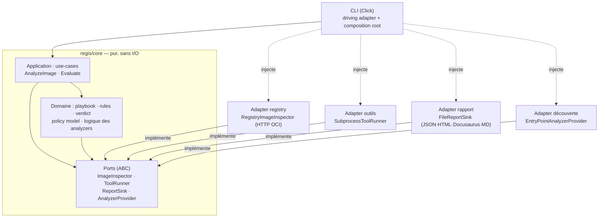
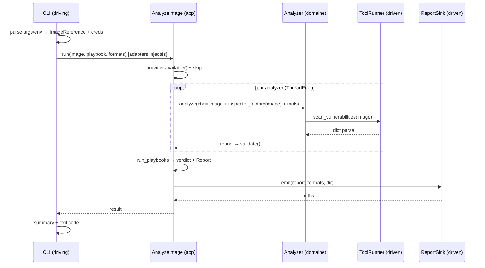

# Migration vers une architecture hexagonale (ports & adapters)

- **Date** : 2026-06-13
- **Statut** : Design validé (brainstorming) — en attente de relecture avant rédaction du plan
- **Type** : Refonte architecturale (pré-v1, breaking)
- **Périmètre** : cœur `regis/` (Python). La dashboard, regis-backstage, regis-action, regis-gitlab ne sont pas concernés.

## 1. Contexte & motivation

`regis` est aujourd'hui « modulaire et pluggable » mais pas hexagonal : le domaine dépend
directement d'infrastructure concrète. Preuves relevées dans le code :

- **Contrat d'analyzer couplé à l'infra** : `BaseAnalyzer.analyze(self, client: RegistryClient,
repository, tag, platform=None)` reçoit une **classe concrète** d'infrastructure. C'est un point
  d'extension public (entry points `regis.analyzers`).
- **Contrat surchargé / incohérent** : `MetadataAnalyzer.analyze` ignore totalement `client`
  (signature `client: Any = None`, docstring « Ignored ») ; `CveAnalyzer.analyze` ne lit que
  `client.registry / username / password` pour les passer à `run_grype(...)`. Le même paramètre sert
  tantôt d'inspecteur de registry, tantôt de simple porteur d'auth, tantôt de rien.
- **Câblage de l'infra dans la couche CLI** : `_run_analyzer` (dans `regis/commands/analyze.py`,
  752 lignes) instancie un `RegistryClient` en dur et le passe à l'analyzer.
- **Exceptions du framework CLI qui fuient dans l'infra** : `run_cmd` et `ensure_tool`
  (`regis/utils/process.py`) lèvent `click.ClickException` ; `click` est importé dans la couche
  outils. (`run_grype` lève déjà `AnalyzerError`, mais via une couche qui dépend de `click`.)
- **Tests fragiles par monkeypatching** : `CLAUDE.md` documente une liste de cibles de patch
  (`regis.commands.analyze.{RegistryClient,_discover_analyzers}`, `regis.utils.process.{shutil,
subprocess}`, `regis.utils.report.jsonschema`, …) — symptôme direct de l'absence de ports
  injectables. Couplé à la fragilité « entry points périmés » de `discover_analyzers()`.

**Les quatre moteurs de la migration** (tous retenus, ils pointent dans la même direction) :

1. **2ᵉ point d'entrée** — pouvoir réutiliser le moteur d'analyse hors CLI (librairie/API pour
   regis-backstage, un serveur). _Débloqué_ par ce chantier, pas _construit_ ici.
2. **Contrat de plugin propre** — découpler le contrat analyzer de l'infra concrète avant la v1.
3. **Testabilité** — supprimer le monkeypatching au profit de fakes injectés.
4. **Hygiène pré-v1** — poser la frontière nette avant de figer l'API en v1.

## 2. Décisions

| Sujet                      | Décision                                                                                                                                                   | Justification                                                                                       |
| -------------------------- | ---------------------------------------------------------------------------------------------------------------------------------------------------------- | --------------------------------------------------------------------------------------------------- |
| Style                      | **Strict & outillé** (textbook) : packages explicites, ports en **ABC**, composition root explicite, règle de dépendance imposée par `import-linter` en CI | Meilleure fondation pour le 2ᵉ point d'entrée + hygiène pré-v1 ; le projet enforce déjà tout par CI |
| Périmètre du livrable      | **Cœur hexagonal, la CLI reste l'unique adaptateur driving** ; le 2ᵉ point d'entrée devient possible mais n'est pas livré                                  | Périmètre maîtrisé, un seul spec                                                                    |
| Compat du contrat analyzer | **Rupture nette** — aucun shim public livré ; tous les analyzers internes migrés ; guide d'upgrade pour les plugins tiers                                  | Pré-v1, les breaking changes y sont la routine ; pas d'écosystème de plugins tiers à protéger       |
| Approche de migration      | **Incrémentale, strangler** ; suite verte à chaque PR                                                                                                      | Dev actif + double gate de couverture interdisent un big-bang                                       |
| `ToolRunner`               | **Orienté capacités** (`scan_vulnerabilities`, `generate_sbom`, …) **+ échappatoire générique `run(tool, args)`**                                          | Domaine propre pour les 6 outils internes (fakes = dict canné) ; ouvert pour les plugins            |
| Conteneur DI               | **Non** — composition root = une simple fonction de câblage dans l'adapter CLI                                                                             | Cérémonie inutile pour un mainteneur solo                                                           |

## 3. Architecture cible

L'invariant : **toutes les dépendances pointent vers l'intérieur**. Le cœur ne connaît que des
Ports ; les adapters les implémentent ; la CLI (composition root) câble le concret.



### 3.1 Arborescence

```text
regis/
├── core/                       # PUR — aucun import vers adapters/
│   ├── domain/
│   │   ├── analyzers/          # base.py (nouveau contrat) + les 14 analyzers (logique seule)
│   │   ├── playbook/           # engine, evaluator, conditions, context, presentation,
│   │   │                       #   schema_registry, templates, verdict
│   │   ├── rules/              # evaluator (opérateurs JSON Logic)
│   │   ├── model/              # ImageReference, AnalysisContext, Report, Verdict
│   │   └── errors.py           # RegisError et sa hiérarchie
│   ├── application/            # use-cases (orchestration)
│   │   ├── analyze_image.py    # ex-orchestration de commands/analyze.py
│   │   └── evaluate.py         # ex-evaluate_cmd
│   └── ports/                  # interfaces (ABC) que le cœur définit
│       ├── image_inspector.py
│       ├── tool_runner.py
│       ├── report_sink.py
│       └── analyzer_provider.py
├── adapters/
│   ├── driving/cli/            # ex-cli.py + commands/* — fin : câble, appelle les use-cases
│   └── driven/
│       ├── registry/           # ex-registry/ → ImageInspector
│       ├── tools/              # ex-tools/ + ex-utils/{process,grype,regctl,syft,trufflehog,…} → ToolRunner
│       ├── report/             # ex-report/ + part émission de utils/report.py → ReportSink
│       └── analyzers/          # ex-analyzers/discovery.py → AnalyzerProvider
├── schemas/                    # ressources JSON Schema (data packagée) — inchangé
├── cookiecutters/ · data/      # data packagée — inchangé
```

Point subtil assumé : les **classes d'analyzer** sont du domaine (logique pure, dépendances
injectées via `AnalysisContext`), mais le **mécanisme de découverte** (`importlib.metadata`) est un
adapter. C'est ce couplage qui cause les soucis d'« entry points périmés » et qui bloquera
l'enregistrement programmatique d'analyzers pour le futur 2ᵉ point d'entrée.

### 3.2 Règle de dépendance

Un seul contrat `import-linter` (couches linéaires) :

```text
regis.adapters → regis.core.application → regis.core.domain → regis.core.ports
```

Chaque couche n'importe que vers la droite. Conséquence imposée : `core/*` ne peut **jamais**
importer `adapters/*` ni `click`.

## 4. Ports & contrat d'analyzer

ABC dans `regis/core/ports/`. Les fakes de test sous-classent ces ABC.

### 4.1 Ports côté application (utilisés par les use-cases)

```python
class AnalyzerProvider(ABC):          # ex-discovery.py
    @abstractmethod
    def available(self) -> Mapping[str, type[BaseAnalyzer]]: ...

class ReportSink(ABC):                # ex-write_report / render_and_save_reports
    @abstractmethod
    def emit(self, report: Report, *, formats: Sequence[str], output_dir: Path) -> list[Path]: ...
```

### 4.2 Ports côté domaine (injectés dans chaque analyzer)

```python
class ImageInspector(ABC):            # ex-RegistryClient (API publique)
    @abstractmethod
    def list_tags(self) -> list[str]: ...
    @abstractmethod
    def get_manifest(self, reference: str) -> dict[str, Any]: ...
    @abstractmethod
    def get_blob(self, digest: str) -> bytes: ...
    @abstractmethod
    def get_digest(self, reference: str) -> str: ...

@dataclass
class ToolResult:
    stdout: str
    stderr: str
    exit_code: int

class ToolRunner(ABC):                # ex-utils/process + run_grype/run_syft/…
    @abstractmethod
    def scan_vulnerabilities(self, image: ImageReference) -> dict[str, Any]: ...   # grype
    @abstractmethod
    def generate_sbom(self, image: ImageReference) -> dict[str, Any]: ...          # syft
    @abstractmethod
    def scan_secrets(self, image: ImageReference) -> dict[str, Any]: ...           # trufflehog
    @abstractmethod
    def lint_dockerfile(self, dockerfile: str) -> dict[str, Any]: ...              # hadolint
    @abstractmethod
    def audit_image(self, image: ImageReference) -> dict[str, Any]: ...            # dockle
    @abstractmethod
    def inspect_platforms(self, image: ImageReference) -> dict[str, Any]: ...      # regctl
    @abstractmethod
    def run(self, tool: str, args: Sequence[str], *, timeout: int | None = None) -> ToolResult: ...
```

L'adapter `ToolRunner` encapsule ce que le domaine ne doit plus voir : résolution du binaire
(`ensure_tool`), `subprocess`, injection d'auth (`SYFT_REGISTRY_AUTH_*` pour grype), parsing. Les
**credentials vivent dans les adapters** (câblés par la composition root) — un analyzer ne voit plus
jamais de mot de passe. (Le jeu exact de méthodes capacité sera figé au plan, à partir des wrappers
réels `run_grype/run_syft/…` ; `run()` reste l'échappatoire des plugins.)

### 4.3 Value objects & nouveau contrat

```python
@dataclass(frozen=True)
class ImageReference:                 # value object de domaine — PAS de creds
    registry: str
    repository: str
    tag: str
    platform: str | None = None

@dataclass
class AnalysisContext:
    image: ImageReference
    inspector: ImageInspector
    tools: ToolRunner

class BaseAnalyzer(ABC):
    name: str = ""
    schema_file: str = ""

    @classmethod
    def default_criteria(cls) -> list[dict[str, Any]]: ...

    @abstractmethod
    def analyze(self, ctx: AnalysisContext) -> dict[str, Any]: ...

    def validate(self, report: dict[str, Any]) -> None: ...   # inchangé (jsonschema)
```

Avant → après, sur les deux pôles :

- **cve** : `run_grype(full_image, client.username, client.password, platform)` →
  `ctx.tools.scan_vulnerabilities(ctx.image)`. Auth et `-o json` disparaissent dans l'adapter.
- **metadata** : faux paramètre `client: Any = None` (« Ignored ») → reçoit `ctx`, n'en utilise rien.

Les inputs spécifiques à construction (ex. les métadonnées de `MetadataAnalyzer`, passées
aujourd'hui via `__init__`) restent fournis par le use-case à l'instanciation ; ce point sera
précisé au plan.

## 5. Adapters, composition root, flux & erreurs

### 5.1 Adapters driven

| Adapter                      | Port               | Enveloppe l'existant                                                                 |
| ---------------------------- | ------------------ | ------------------------------------------------------------------------------------ |
| `RegistryImageInspector`     | `ImageInspector`   | `registry/{client,auth,parser}.py`                                                   |
| `SubprocessToolRunner`       | `ToolRunner`       | `utils/{process,grype,regctl,syft,trufflehog,…}` + `tools/{fetcher,manifest,cosign}` |
| `FileReportSink`             | `ReportSink`       | `report/html.py` + part _émission_ de `utils/report.py`                              |
| `EntryPointAnalyzerProvider` | `AnalyzerProvider` | `analyzers/discovery.py`                                                             |

### 5.2 Split de `utils/report.py`

Ce module mélange émission et politique. Il faut le couper :

- _Émission_ → `adapters/driven/report/` : `write_report`, `render_and_save_reports`,
  `render_presentation_templates`, `_render_markdown`, `_verdict_markdown`, `format_output_path`.
- _Domaine/application_ → `core/` : `run_playbooks`, `evaluate_playbooks`, `validate_report`,
  `ensure_schema_version`, `REPORT_SCHEMA_VERSION`, `set_nested_value`.

### 5.3 Composition root & sécurité des threads

`_run_analyzer` construit aujourd'hui **un `RegistryClient` neuf par analyzer/par thread** (le
`requests.Session` n'est pas partageable ; `ThreadPoolExecutor`, 4 workers par défaut). Le use-case
ne reçoit donc pas un inspector partagé mais une **factory**
`Callable[[ImageReference], ImageInspector]`, invoquée par tâche. La composition root (une fonction
de câblage dans l'adapter CLI — pas de conteneur DI) assemble factory + runner + sink + provider et
les injecte dans `AnalyzeImage`.

### 5.4 Flux `analyze`



### 5.5 Gestion d'erreurs

Hiérarchie `core/domain/errors.py` : `RegisError` → `AnalyzerError` (déplacée), `RegistryError`,
`ToolError`, `ReportError`, `PlaybookError`. Les adapters lèvent **ces** erreurs (fin du
`click.ClickException` dans `run_cmd`/`ensure_tool`, fin de l'import `click` dans la couche outils).
**Seule la CLI** rattrape `RegisError` et la mappe en `ClickException` (messages + codes de sortie).
C'est la condition pour que `core/*` n'importe plus `click` et que le contrat import-linter passe.

## 6. Enforcement (`import-linter`)

`import-linter` ajouté en dev dep (`[dependency-groups]`). Contrat dans `pyproject.toml` :

```ini
[importlinter]
root_package = regis

[importlinter:contract:hexagonal-layers]
name = Hexagonal layering
type = layers
layers =
    regis.adapters
    regis.core.application
    regis.core.domain
    regis.core.ports
```

CI : étape `uv run lint-imports` dans `ci-lint.yml`, qui casse le build à la première violation —
même registre que le double gate de couverture et `generated-artifacts-guard`.
`regis.schemas`/`cookiecutters`/`data` ne sont pas dans le contrat → restent accessibles au domaine
comme ressources packagées (exception pragmatique assumée : pas de port `ResourceLoader`, la
validation JSON Schema est déterministe).

## 7. Stratégie de test

Le monkeypatching documenté dans `CLAUDE.md` disparaît au profit de fakes implémentant les ports :

```python
class FakeToolRunner(ToolRunner):
    def scan_vulnerabilities(self, image): return {"matches": [...]}   # dict canné, zéro subprocess
    def generate_sbom(self, image): return {...}
    def run(self, tool, args, *, timeout=None): ...
```

Taxonomie :

- **Domaine / application** : use-cases + analyzers pilotés par fakes. Rapides, hermétiques, aucun
  binaire grype/syft requis ; plus de fragilité « entry points périmés » (`StubAnalyzerProvider`).
- **Adapters** : la seule couche qui touche le réel — `RegistryImageInspector` via `responses`,
  `SubprocessToolRunner` sur fixtures enregistrées, `FileReportSink` sur `tmp_path`.
- **CLI** : `CliRunner` avec fakes injectés → parsing d'args, codes de sortie, mapping
  `RegisError → ClickException`.

Conséquences à acter :

- **Double gate de couverture (90 % global + par fichier)** : chaque _nouveau_ fichier cœur naît à
  ≥ 90 %. Le phasing impose donc « ports + fakes + tests » dans le même lot que le code couvert —
  pas de fichier nu. `tests/_per_file_coverage.py` + `conftest.py` restent inchangés
  structurellement (ils mesurent `regis/` quel que soit le layout).
- La section « Test patch targets » de `CLAUDE.md` est **réécrite** (« patcher l'infra à tel
  module » → « injecter des fakes de ports ») : livrable doc du chantier.

## 8. Phasing (strangler)

`core/` et `adapters/` cohabitent avec l'ancien arbre pendant la bascule. Le contrat import-linter
ne gouverne **que** les nouveaux packages — l'ancien code top-level reste hors-contrat jusqu'à son
déménagement, donc la CI ne casse jamais prématurément.

| Phase                                   | Contenu                                                                                                                                                                         | Granularité        |
| --------------------------------------- | ------------------------------------------------------------------------------------------------------------------------------------------------------------------------------- | ------------------ |
| **P0 — Squelette + gate**               | Packages `core/`+`adapters/` vides, `core/domain/errors.py`, `import-linter` + contrat (passe à vide) + étape CI. Additif.                                                      | 1 petite PR        |
| **P1 — Ports + value objects + fakes**  | Les 4 ABC, `ImageReference`/`AnalysisContext`/`Report`, fakes de test.                                                                                                          | 1 PR               |
| **P2 — Adapters enveloppent l'infra**   | `RegistryImageInspector`, `SubprocessToolRunner`, `FileReportSink`, `EntryPointAnalyzerProvider` — délégateurs fins ; traduction des exceptions en `RegisError`. Tests adapter. | 2–4 PR             |
| **P3 — Use-cases + bascule du contrat** | `AnalyzeImage`/`Evaluate` ; analyzers migrés **par groupe** (outils → registry → purs) ; tests passent aux fakes.                                                               | P3.0 + 1 PR/groupe |
| **P4 — Déménagement physique**          | `git mv` de l'infra sous `adapters/driven/*`, du domaine sous `core/*`, `cli.py`+`commands/*` sous `adapters/driving/cli/`. Le contrat gouverne alors tout le dépôt.            | 1 PR/sous-arbre    |
| **P5 — Docs & cleanup**                 | Réécriture `CLAUDE.md`, `systemPatterns.md`, entrée `decisionLog.md`, guide d'upgrade plugins tiers, `techContext.md`.                                                          | 1 PR               |

**Bascule du contrat sans mega-PR (P3)** — pont interne temporaire sur `BaseAnalyzer` : le nouveau
`analyze(ctx)` reconstruit les anciens args depuis `ctx` tant qu'un analyzer n'est pas migré. Ce pont
est **supprimé en P3.final** — jamais publié. Il ne contredit pas la « rupture nette » (qui concerne
la compat' des plugins **tiers**, pas l'échafaudage interne de branche). Alternative écartée : une
seule PR atomique pour les 14 analyzers (gros diff, pénible à reviewer et à rebaser).

**Gotchas projet intégrés** :

- **Plans éphémères** : chaque phase a son plan sous `docs/superpowers/plans/`, **supprimé de la
  branche avant merge** (sinon il atterrit sur `main` et casse le guard « No Execution Plans »).
  Seul ce spec survit.
- **Bot auto-rebase** : il réécrit les branches quand `main` avance → PR courtes, branchées sur
  `main` juste avant commit, mergées vite ; vérifier `HEAD == origin/<branch>` avant de se fier à un
  push.

## 9. Hors périmètre (YAGNI)

- **Le 2ᵉ point d'entrée lui-même** (façade librairie / serveur / consommation par regis-backstage) :
  _débloqué_, pas construit.
- **Port `ResourceLoader` / `PlaybookSource`** : les schémas et playbooks bundlés restent des
  ressources packagées lues par le domaine. À reconsidérer si le 2ᵉ point d'entrée l'exige.
- **Conteneur DI** : composition root = fonction de câblage.
- **Ports en `Protocol`** : on reste sur ABC (choix « strict »).
- **Shim de dépréciation public** pour les plugins tiers : remplacé par un guide d'upgrade.
- **Traitement complet des commandes hors cœur** (`bootstrap`, `doctor`, `check`, `rules`,
  `playbook`) : elles deviennent des commandes driving fines et appellent le domaine/les use-cases là
  où elles touchent du code déplacé, sans port dédié. Le chemin `analyze`/`evaluate` est la priorité.

## 10. Risques & mitigations

| Risque                                                               | Mitigation                                                                                          |
| -------------------------------------------------------------------- | --------------------------------------------------------------------------------------------------- |
| Gros diffs de déménagement (P4) pénibles à rebaser (bot auto-rebase) | Logique déjà en place avant P4 ; P4 = `git mv` + fix d'imports, découpé par sous-arbre ; PR courtes |
| Dip de couverture par fichier pendant la transition                  | Chaque phase migre **et** supprime l'ancien chemin dans la même PR ; pas de fichier nu              |
| Pont interne P3 oublié en place                                      | DoD explicite : suppression du pont + de l'ancien `analyze(client,…)` en P3.final                   |
| Régression fonctionnelle silencieuse                                 | Adapters P2 = délégateurs fidèles ; la suite (≥ 543 tests) prouve l'équivalence à chaque phase      |
| Plugins tiers cassés                                                 | Rupture assumée + guide d'upgrade (P5)                                                              |

## 11. Definition of Done

- [ ] `core/*` n'importe ni `adapters/*` ni `click` ; contrat `import-linter` vert en CI.
- [ ] `BaseAnalyzer.analyze(self, ctx: AnalysisContext)` ; les 14 analyzers migrés ; pont interne
      supprimé ; ancien `analyze(client, …)` retiré.
- [ ] 4 ports ABC + adapters correspondants ; credentials confinés aux adapters.
- [ ] `utils/report.py` scindé (émission vs politique).
- [ ] Hiérarchie `RegisError` ; `ClickException` uniquement au bord CLI.
- [ ] Tests réorganisés (domaine via fakes, adapters via `responses`/fixtures/`tmp_path`, CLI via
      `CliRunner`) ; double gate de couverture vert.
- [ ] Docs à jour : `CLAUDE.md` (patch targets + archi), `systemPatterns.md`, `decisionLog.md`,
      `techContext.md`, guide d'upgrade plugins tiers.
- [ ] Aucun plan d'exécution laissé sur `main`.
