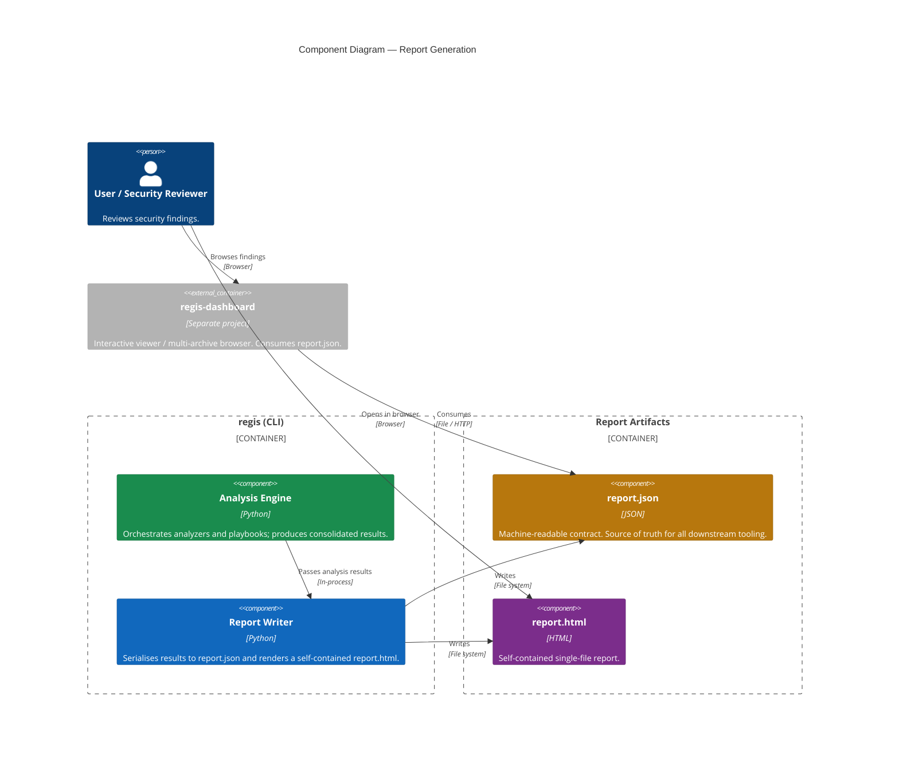

# Reports

One of the core missions of `regis` is to bridge the gap between automated tools and human review through **Visual Excellence**. Reports display the results of [rule evaluation](./rules.md) and the overall [score](./scoring.md).

## The Reporting Engine

The Regis core CLI produces two report artifacts:

- **`report.json`** — the source of truth. A machine-readable document containing all analysis and evaluation data, perfect for automated processing and as the contract every downstream tool consumes.
- **`report.html`** — a self-contained, single-file HTML report. Fully portable: open it in any browser or ship it as a CI/CD artifact, no server or base URL configuration required.

For a fully **interactive** dashboard — instant filtering, sorting, and searching across thousands of findings, plus multi-archive browsing — use the standalone [`regis-dashboard`](https://github.com/trivoallan/regis-dashboard) project. It consumes the same `report.json` contract and `--archive` data the core CLI emits.

The following diagram illustrates the relationship between the CLI and the generated reports:



This architecture allows for:

- **A Stable Contract**: `report.json` is a documented, machine-readable contract every downstream tool can rely on.
- **Self-Contained Portability**: `report.html` is a single file, ready to be served from any static host or viewed as a CI/CD artifact.
- **Rich Interactivity**: The standalone dashboard adds instant filtering, sorting, and searching across thousands of vulnerability findings.

## Philosophy: Visual Excellence

We believe that security reports should be easy to read and aesthetically pleasing. A well-designed report:

1. **Reduces Cognitive Load**: Highlighting the most important issues first through clear categorization and visual cues.
2. **Encourages Adoption**: Teams are more likely to engage with security when given clear, actionable, and professional feedback.
3. **Facilitates Decision Making**: Using color-coded risk levels and intuitive navigation to distinguish between minor warnings and critical blockers.

## Hybrid Reporting

`regis` follows a "hybrid" reporting strategy:

- **JSON Report**: The source of truth. A machine-readable document containing all analysis and evaluation data, perfect for automated processing.
- **HTML Report**: A human-friendly, self-contained single-file report that consumes the same data.

```bash
# Generate both report.json and a self-contained report.html
regis analyze <image-url> --html
```

:::tip
For a rich, interactive dashboard that consumes the `report.json` contract, see the standalone [regis-dashboard](https://github.com/trivoallan/regis-dashboard) project.
:::
