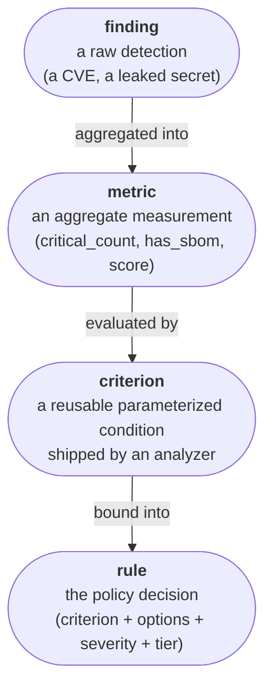
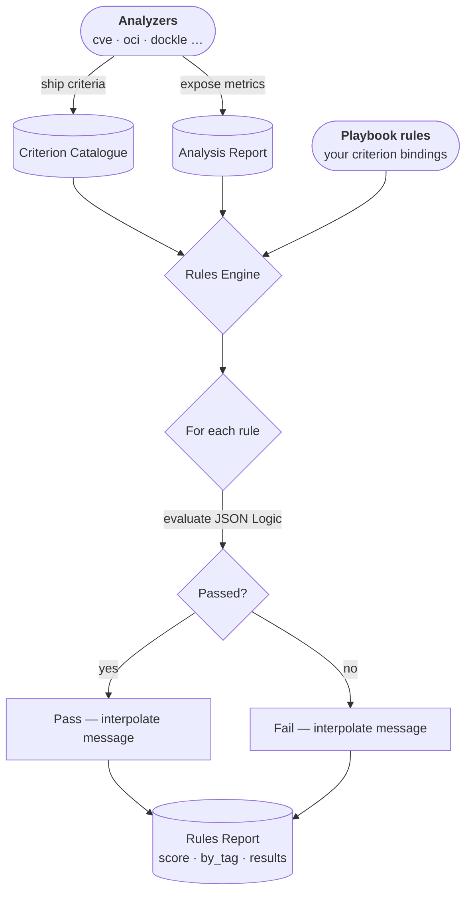

# Rules and criteria

Rules are the evaluation heart of Regis. A **rule** is the policy decision your
playbook makes: it binds a reusable **criterion** to concrete options, a severity
level, and a tier. Criteria are shipped by [analyzers](./analyzers.md); rules are
written by you in a [playbook](./playbooks.md). Their results feed into the
overall [score](./scoring.md).

## The four-layer model

Regis separates _what an analyzer detects_ from _the policy you enforce_ through
four layers. Read the chain from the bottom up: evidence is aggregated into
measurements, measurements are evaluated by conditions, and conditions are bound
into decisions.



| Layer         | What it is                                                                                                                                                                     | Who owns it |
| :------------ | :----------------------------------------------------------------------------------------------------------------------------------------------------------------------------- | :---------- |
| **finding**   | A raw detection of a problem (a CVE on a package, a leaked secret). Evidence for drill-down.                                                                                   | Analyzer    |
| **metric**    | An aggregate measurement an analyzer exposes (`critical_count`, `has_sbom`, `score`). Lives under `results.<analyzer>.<metric>`. **This is what criteria evaluate.**           | Analyzer    |
| **criterion** | A reusable, parameterized _condition_ shipped by an analyzer (for example, the `cve-count` criterion). Policy-neutral: it carries a JSON Logic `condition` plus open `params`. | Analyzer    |
| **rule**      | The policy _decision_: a criterion bound to concrete options, a severity `level`, and a tier. This is what you write in a playbook.                                            | You         |

:::info
SBOM **components** are inventory, not findings — having a package is not, by
itself, a problem. See
[Analyzers](./analyzers.md#what-an-analyzer-exposes).
:::

## Criteria vs. rules

A **criterion** is policy-neutral. The `cve-count` criterion knows _how_ to count
vulnerabilities at a given severity and compare the count against a threshold, but
it does not decide _which_ severity matters or _how many_ are too many. Those are
policy choices.

A **rule** makes those choices. You build a rule by binding a criterion to:

- concrete **options** (the values its `params` take — for example, `level: critical`, `max_count: 0`);
- a severity **level** (`critical`, `high`, `warning`…) that drives scoring;
- the **tier** it contributes to.

The same criterion can back many rules. A single `cve-count` criterion can be
bound once to forbid all critical CVEs and again to tolerate up to ten
high-severity CVEs.

## How rules are evaluated

When `regis` runs an analysis, the rules engine:

1. **Builds the criterion catalogue** — the reusable, parameterized conditions
   shipped by every analyzer that participated in the run, plus the core
   `registry-domain-whitelist`. The catalogue is _not_ evaluated on its own.
2. **Resolves the playbook's declared rules** against that catalogue. The
   evaluated set is exactly what the playbook declares: there is no implicit
   inheritance of analyzer defaults.
3. **Evaluates** each active rule's condition against the analysis report using [JSON Logic](https://jsonlogic.com/).
4. **Interpolates** pass/fail messages with live report values.
5. **Produces** a scored rules report.



## The criterion catalogue

Each analyzer ships reusable **criterion templates** (e.g. `cve:cve-count`,
`oci:max-size`). These templates are a catalogue you bind from a playbook — they
are **never evaluated unless a playbook declares them**. To evaluate one, add a
rule under `spec.rules` that binds the criterion:

:::tip
For the full list of standard criteria, their parameters, and condition details,
see the [Rules Reference](../reference/rules/).
:::

You can inspect the catalogue at any time from the CLI:

```bash
# List all criteria in the catalogue (table)
regis rules list

# Show the full definition of a specific criterion
regis rules show cve-count
```

## Writing rules in a playbook

Add a `rules` list under `spec` in your `playbook.yaml` to declare, bind, or
customize rules.

### Binding a catalogue criterion

Reference a criterion from the catalogue by its `provider` and `criterion` key.
Set the level, options, or messages you want to enforce:

```yaml
spec:
  rules:
    # Demote critical CVE rule to a warning
    - provider: cve
      criterion: fix-available
      level: warning
      messages:
        fail: "${results.cve.fixed_count} patchable vulnerabilities found — please fix soon."

    # Disable a rule entirely
    - provider: oci
      criterion: platforms-count
      enable: false

    # Restrict to your private registry only
    - provider: core
      criterion: registry-domain-whitelist
      options:
        domains: ["my-private-registry.example.com"]
```

:::note
The `criterion:` key replaces the older `rule:` key, which referenced the same
thing. `rule:` still works as a deprecated alias and emits a warning. To migrate
existing playbooks automatically, run `regis playbook migrate` — see the
[migration guide](../upgrade/rule-to-criterion.md).
:::

### Binding a criterion several times

Many criteria are designed to be bound multiple times with different options. Use
`provider` + `criterion` + `options` to create a named rule. Give each binding its
own `slug`:

```yaml
spec:
  rules:
    # Block any critical CVEs
    - provider: cve
      criterion: cve-count
      slug: cve-critical
      options:
        level: critical
        max_count: 0

    # Allow up to 10 high-severity CVEs
    - provider: cve
      criterion: cve-count
      slug: cve-high-tolerance
      options:
        level: high
        max_count: 10
```

When no `slug` is provided, the engine generates one automatically from the
criterion name and the `level` option (for example, `cve-count.critical`).

:::note
Criteria such as `cve/cve-count`, `hadolint/severity-count`, or
`dockle/severity-count` are multi-purpose. Rather than shipping one hard-coded
rule per severity, a single criterion can be bound as many times as you need.
:::

### Adding a fully custom rule

You can define completely new rules with arbitrary JSON Logic conditions instead
of binding a shipped criterion. Metrics are read from the `results.*` namespace:

```yaml
spec:
  rules:
    - slug: company-label-required
      description: Image must carry the company owner label.
      level: critical
      tags: [compliance]
      condition:
        "in":
          [
            "my-company.owner",
            { "keys": [{ "var": "results.oci.platforms.0.labels" }] },
          ]
      messages:
        pass: "Company label is present."
        fail: "Missing 'my-company.owner' label."
```

## Rule evaluation mechanics

### JSON Logic conditions

Rule conditions are expressed as [JSON Logic](https://jsonlogic.com/) objects. The
evaluation context exposes the full, flattened analysis report. Analyzer
**metrics** are always under the `results.*` namespace (for example,
`results.cve.critical_count`).

Regis adds several custom operators on top of the standard set:

| Operator       | Description                                                      |
| :------------- | :--------------------------------------------------------------- |
| `intersects`   | `true` if any element of list _a_ is present in list _b_.        |
| `contains_all` | `true` if all elements of list _b_ are present in list _a_.      |
| `subset`       | `true` if all elements of list _a_ are also in list _b_.         |
| `keys`         | Returns the keys of a dictionary.                                |
| `get`          | Gets a value from a dictionary by a computed key.                |
| `env_contains` | `true` if any string in _b_ is a substring of any string in _a_. |

The bound criterion's options are accessible under `criterion.params.*` (for
example, `{"var": "criterion.params.max_count"}`).

:::note
The legacy `rule.params.*` namespace still resolves during the deprecation
window but is deprecated in favor of `criterion.params.*`.
:::

### String interpolation

Pass and fail messages support `${path.to.var}` interpolation against the same
evaluation context. Use `results.*` for metrics and `criterion.params.*` for the
bound criterion's options:

```yaml
messages:
  pass: "Image is ${results.freshness.age_days} days old — within the ${criterion.params.max_days}-day limit."
  fail: "Image is ${results.freshness.age_days} days old (limit: ${criterion.params.max_days})."
```

### Incomplete rules

If the evaluation context is missing data that a condition accesses (for example,
an analyzer did not run), the rule is marked **`incomplete`** rather than
`failed`. This prevents false negatives when an analyzer is simply not part of the
current run.

## Evaluating rules from the CLI

```bash
# Evaluate a report against the default playbook rules
regis rules evaluate report.json

# Use a custom playbook
regis rules evaluate report.json --rules playbook.yaml

# Export results as JSON
regis rules evaluate report.json -o rules_report.json
```

### Blocking CI/CD pipelines

Use `--fail` to exit with a non-zero code when rules breach a given severity
threshold:

```bash
# Fail the pipeline if any CRITICAL rule is breached
regis rules evaluate report.json --fail

# Fail on WARNING or above
regis rules evaluate report.json --fail --fail-level warning
```
